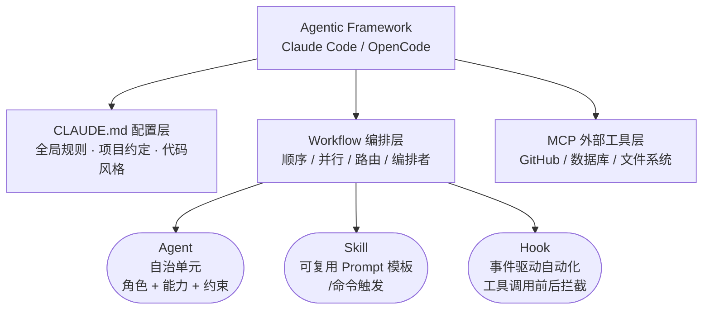

# Ch0: 工具选型 — Claude Code、Cursor、Copilot 怎么选

> 在动手之前，先看看这个江湖里都有谁。
>
> | 章节 | 关键词 |
> |:-----|:------|
> | **► Ch0 工具选型** | **工具选型 · 开发模式** |
> | Ch1 需求分析 | Plan Agent · 需求分析 |
> | Ch2 搭建脚手架 | CLAUDE.md · CLI 搭建 |
> | Ch3 解析 Git Diff | Explore Agent · Git Diff |
> | Ch4 Agent 设计 | Agent 设计 · Prompt 工程 |
> | Ch5 Fan-out/Fan-in | Fan-out/Fan-in · 并行执行 |
> | Ch6 结果聚合 | 结果聚合 · 条件逻辑 |
> | Ch7 Hooks 与 Skills | Hooks · Skills |
> | Ch8 测试驱动 | 测试策略 · TDD |
> | Ch9 六种编排模式 | 模式提炼 · 最佳实践 |
> | 附录 课后作业 | Workflow 实战 |

**术语**

- CLI（Command Line Interface，命令行界面）
- LLM（Large Language Model，大语言模型）
- MCP（Model Context Protocol，模型上下文协议）
- TUI（Terminal User Interface，终端用户界面）
- LSP（Language Server Protocol，语言服务器协议）
- API（Application Programming Interface，应用编程接口）
- TDD（Test-Driven Development，测试驱动开发）
- PRD（Product Requirements Document，产品需求文档）
- SDD（Spec-Driven Development，规格驱动开发）
- CRUD（Create/Read/Update/Delete，增删改查）

## 场景引入

你刚听说"AI 写代码"这件事，打开搜索引擎一查——好家伙，Claude Code、Codex CLI、Gemini CLI、OpenCode，还有一堆叫 Something-Claw 的东西。每个都说自己能帮你写代码，每个看起来都差不多。

别慌。这一章帮你理清楚：这些工具是什么，它们之间有什么区别，以及为什么选 Claude Code 来构建这个教程的项目。

---

## 0.1 什么是 AI Coding Agent？

先搞清楚一个概念：AI Coding Agent ≠ ChatGPT 聊天框里写代码。

**聊天式 AI**：你问它一个问题，它给你一段代码，你复制粘贴到编辑器里。一来一回，像发微信。

**AI Coding Agent**：它能直接操作你的文件系统——读代码、改代码、跑命令、装依赖。你给它一个任务，它自己规划步骤、自己执行、遇到问题自己调整。像一个坐在你旁边的程序员，而不是一个聊天窗口。

关键区别在于 **自主性**：Agent 能自己决定下一步做什么，而不是等你一步步指挥。

```
聊天式 AI:  你说 → AI 回复 → 你复制 → 你粘贴 → 你运行 → 出错 → 你再问
AI Agent:   你说 → Agent 读代码 → Agent 改代码 → Agent 跑测试 → Agent 修 bug → 搞定
```

---

## 0.2 主流 AI Coding Agent 一览

> 数据截至 2026 年 2 月。版本号和功能状态会随时间变化，以各工具官方文档为准。

### 0.2.1 总览

| 工具 | 出品方 | 形态 | 底层模型 | 核心卖点 |
|------|--------|------|----------|----------|
| **Claude Code** | Anthropic | CLI (v2.1.x) | Claude Opus 4.6 | Agent 编排最完整（subagent 并行、Hooks、Skills） |
| **Codex CLI** | OpenAI | CLI (v0.101.x) + 桌面端 + IDE | GPT-5.3-Codex | 沙箱隔离（Docker + approval modes） |
| **Gemini CLI** | Google | CLI (v0.27+) | Gemini 3 Flash / Pro | 超长上下文（Pro 2M / Flash 1M token） |
| **OpenCode** | SST (开源) | CLI (v1.2.x) + 桌面端 + IDE | 75+ 后端可选 | 模型无关 + LSP 深度集成 |
| **Aider** | 社区 (开源) | CLI (v0.86.x) | 多模型可选 | 深度 Git 集成 + Repo Map |

### 0.2.2 编排能力对比

这张表是选型的关键——本教程教的就是这些能力：

| 能力 | Claude Code | Codex CLI | Gemini CLI | OpenCode | Aider |
|------|:-----------:|:---------:|:----------:|:--------:|:-----:|
| Subagent 并行 | ✅ 原生 | ✅ Codex App | ⚠️ 实验性 | ✅ 原生 | ❌ |
| Hooks 自动化 | ✅ | ❌ | ✅ | ✅ | ❌ |
| Skills 自定义命令 | ✅ | ✅ | ✅ | ✅ | ❌ |
| MCP 协议 | ✅ 3000+ 服务 | ✅ | ✅ | ✅ | ⚠️ AiderDesk |
| 沙箱隔离 | ❌ | ✅ | ✅ | ❌ | ❌ |
| 项目配置文件 | CLAUDE.md | AGENTS.md | GEMINI.md | AGENTS.md | .aider.conf.yml |

### 0.2.3 各工具速写

**商业产品**

- **Claude Code** — 通过 Task tool 派出 `Explore`（只读）/ `Plan`（方案）/ `general-purpose`（通用）三类 subagent，支持同一消息内多 agent 并行。MCP 已接入 3000+ 外部服务。CLAUDE.md 支持全局 → 项目 → 目录三层覆盖。Opus 4.6 支持 1M token 上下文（beta）。**本教程的主角。**
- **Codex CLI** — GPT-5.3-Codex 比前代快 25%。三档自动化：suggest / auto-edit / full-auto。Codex App（2026 年 2 月发布）支持多 agent 并行、Git worktree 隔离。MCP 既能当 client 也能当 server。
- **Gemini CLI** — Gemini 3 Pro 的 2M token 上下文窗口是目前最大的。自定义命令（`.toml`）和 Hooks 已稳定；subagent 仍为实验性功能（需手动开启 `experimental.enableAgents`，并行执行尚未实现）。免费额度充裕（每天最多 1000 次请求）。

**开源项目**

- **OpenCode** — SST 团队维护（仓库 sst/opencode，早期 opencode-ai/opencode 已归档）。Go 编写，Bubble Tea TUI 界面。深度集成 LSP，能像编译器一样理解代码结构。内置 General + Explore 两类 subagent，支持并行执行；也支持通过 `.opencode/agents/*.md` 自定义 agent。Skills（`SKILL.md`）和 Hooks（插件体系）均已稳定。项目指令文件为 `AGENTS.md`。除 CLI 外已推出桌面端和 IDE 扩展（VS Code、Cursor）。
- **Aider** — 老牌 AI pair programming 工具。每次修改自动 commit，`/undo` 一键回滚。独创 Repo Map（基于 tree-sitter）让 LLM 看到整个仓库的函数签名。不支持原生 subagent 和 hooks。

**个人 AI Agent**（不只是编程工具）

- **OpenClaw** — 180K+ GitHub Stars，能自主执行日常任务（邮箱、消息、预订），支持 WhatsApp / Telegram。基于 Claude 模型。⚠️ 曾曝出严重 CVE，创始人已加入 OpenAI。
- **NanoClaw** — OpenClaw 轻量替代（12K+ Stars），容器级隔离（Apple Containers / Docker），基于 Claude Agent SDK。
- **NanoBot** — MCP Agent 框架，YAML/JSON 定义 agent，通过 MCP 协议暴露为 Server。

### 0.2.4 为什么选 Claude Code？

不是因为它"最好"——每个工具都有自己的甜区。选它是因为它的 **agent 编排能力最完整**：原生支持 subagent、并行执行、hooks、skills、MCP。这些正是这个教程要教的东西。用其他工具，你得自己搭很多基础设施；用 Claude Code，这些都是开箱即用的。

### 0.2.5 想用 OpenCode 替代？

如果你更倾向开源方案，OpenCode 是最接近的替代品。它支持 MCP、Hooks、多模型后端，而且免费。但概念体系和 Claude Code 不完全对齐，迁移时需要注意映射关系：

| Claude Code 概念 | OpenCode 对应 | 差异说明 |
|------------------|--------------|---------|
| CLAUDE.md | AGENTS.md | 功能类似，都是项目级指令文件 |
| Skills（`.claude/skills/*/SKILL.md`） | Skills（`.opencode/skills/*/SKILL.md`） | 两者格式已趋同：都用目录 + SKILL.md + YAML frontmatter |
| Agents（`.claude/agents/*.md`） | Agents（`.opencode/agents/*.md`） | 两者都支持 Markdown 定义自定义 agent，格式略有不同（YAML frontmatter） |
| Hooks（`.claude/settings.json`） | Plugins（`opencode.json`） | OpenCode 用 JS/TS 插件体系实现 hooks，比 JSON 配置更灵活 |
| Task tool（Subagent 并行） | 原生 subagent | 内置 General subagent 支持并行执行 |
| MCP | MCP | 两者都完整支持，配置方式不同 |
| Plan Mode（Shift+Tab） | 无直接对应 | 可通过 prompt 指令模拟（"只分析不修改"） |

实际迁移策略：

- **Python 工具层**（diff 解析、报告生成）：零修改，跟 AI 工具无关
- **编排层**（Skill 文件）：改写为 prompt 模板或 shell 脚本，手动调度 agent
- **Agent 层**（角色定义）：将 `.md` 中的 prompt 直接粘贴到 OpenCode 对话中使用

> 💡 **Tip**: 本教程的 Python 代码和架构思想是通用的，不绑定任何特定工具。即使你用 Aider、Gemini CLI 甚至纯 API 调用，核心的 fan-out/fan-in 模式和 agent 设计原则都适用。工具只是载体，编排思维才是重点。

---

## 0.3 AI 时代的开发模式

工具选好了，但怎么用？AI Coding Agent 的出现催生了一批新的开发模式。有些是全新的，有些是经典方法论的 AI 增强版。

### 0.3.1 Vibe Coding（氛围编程）

2025 年 2 月，Andrej Karpathy（OpenAI 联合创始人、前 Tesla AI 负责人）发了一条推文，创造了这个词：

> "fully give in to the vibes, embrace exponentials, and forget that the code even exists"

简单说就是：用自然语言描述你想要什么，AI 生成代码，你不用看懂每一行，只要结果能跑就行。不断迭代，直到满意。

```
你: "帮我做一个待办事项 App"
AI: [生成 200 行代码]
你: "加个深色模式"
AI: [修改代码]
你: "不错，部署吧"
```

**优点**: 上手极快，适合原型验证和个人项目。
**风险**: 代码质量不可控，安全隐患多，不适合生产环境。你可能连自己的代码做了什么都不知道。

**适用场景**: 快速原型、hackathon、个人小工具。

### 0.3.2 TDD with AI（AI 辅助测试驱动开发）

经典 TDD 的流程是 Red → Green → Refactor：先写一个失败的测试，再写最少的代码让它通过，最后重构。

AI Agent 让这个循环变得更高效：

```
1. 你写测试（或让 AI 帮你写）
2. AI Agent 写代码让测试通过
3. 测试失败 → Agent 自动分析错误 → 修复 → 重跑
4. 全部通过 → 重构
```

在 Claude Code 中，你可以用 Hook 实现自动化 TDD 循环——每次代码修改后自动跑测试，失败了 agent 自动修复。这就是 Ch8 会详细讲的内容。

**核心价值**: 测试是"安全网"。有了测试，你可以放心让 AI 大刀阔斧地改代码，因为测试会告诉你有没有改坏东西。

**适用场景**: 任何需要代码质量保障的项目，尤其是多人协作和长期维护的项目。

### 0.3.3 Spec-Driven Development（规格驱动开发）

Vibe Coding 的反面。核心思想：**先写详细的规格说明（Spec），再让 AI 按规格实现**。

```
1. 人类写 Spec（需求文档、接口定义、验收标准）
2. AI 读取 Spec，理解意图
3. AI 按 Spec 逐步实现
4. 用 Spec 中的验收标准验证结果
```

Spec 可以是 Markdown 文档、JSON Schema、甚至是 CLAUDE.md 中的规则。关键是：**Spec 是 single source of truth**，AI 的所有行为都以 Spec 为准。

**优点**: 结果可预测，质量可控，适合团队协作。
**代价**: 前期需要花时间写 Spec，但这个时间会在后面省回来。

**适用场景**: 团队项目、生产环境、需要可审计性的场景。

### 0.3.4 Ralph Loop（自主循环开发）

Ralph（得名于《辛普森一家》的 Ralph Wiggum）是一种让 AI Agent **自主循环运行直到任务完成**的模式。

工作原理：

```
1. 人类写 PRD（产品需求文档），拆成 checklist
2. Agent 启动，读取 PRD
3. Agent 选一个未完成的任务 → 实现 → 测试 → 提交
4. Agent 停止（上下文用完或主动退出）
5. 自动重启，带着全新上下文继续下一个任务
6. 重复 3-5，直到 checklist 全部完成
```

关键设计：**文件系统就是记忆**。每次重启时 agent 的上下文是全新的，但代码库、PRD 文件、进度记录都在磁盘上。Agent 通过读取这些文件来恢复状态。

```
while not all_tasks_done:
    agent = start_fresh_agent()
    agent.read("prd.json")        # 读取需求
    agent.read("progress.md")     # 读取进度
    task = agent.pick_next_task() # 选择下一个任务
    agent.implement(task)         # 实现
    agent.test(task)              # 测试
    agent.commit(task)            # 提交
    agent.update("progress.md")  # 更新进度
```

**优点**: 能处理大型项目，不受上下文窗口限制，可以"过夜运行"。
**风险**: 需要清晰的 PRD 和验收标准，否则 agent 会在错误方向上越跑越远。

**适用场景**: 功能明确的中大型项目、批量 CRUD 开发、夜间自动化构建。

### 0.3.5 Plan-then-Code（先规划后编码）

Claude Code 的 Plan Mode 就是这种模式的典型实现：

```
1. 进入 Plan Mode（只读，不能改代码）
2. Agent 探索代码库，理解现状
3. Agent 制定实施方案
4. 人类审核方案，提出修改
5. 方案确认后，退出 Plan Mode
6. Agent 按方案执行
```

和 Spec-Driven 的区别：Spec-Driven 是人写规格、AI 执行，Plan-then-Code 是 **AI 写方案、人审核**。更适合你对代码库不够熟悉、需要 AI 帮你分析的场景。

**适用场景**: 接手新项目、复杂重构、不确定最佳方案时。

### 0.3.6 模式对比

| 模式 | 谁主导 | 前期投入 | 质量可控性 | 适合场景 |
|------|--------|---------|-----------|---------|
| Vibe Coding | AI | 极低 | 低 | 原型、个人项目 |
| TDD with AI | 人+AI | 中 | 高 | 需要质量保障的项目 |
| Spec-Driven | 人 | 高 | 高 | 团队、生产环境 |
| Ralph Loop | AI | 高（写 PRD） | 中 | 批量开发、夜间构建 |
| Plan-then-Code | AI+人 | 低 | 中 | 探索性任务、重构 |

> 💡 **这些模式不是互斥的。** 实际项目中你往往会混合使用：先用 Plan-then-Code 理解现状，再用 Spec-Driven 定义需求，开发时用 TDD 保障质量，简单的部分直接 Vibe Coding。Review Bot 教程就是这种混合模式的实践。

---

## 0.4 核心概念速览

在正式开始构建项目之前，有几个概念需要先对齐。不用死记，后面每章用到时会反复强化。

### 0.4.1 Agent

一个能自主完成任务的 AI 实体。三要素：

- **角色**（Role）：它是谁？安全审查专家？性能优化师？
- **能力**（Capability）：它能用什么工具？能读文件？能跑命令？
- **约束**（Constraint）：它不能做什么？不能删文件？只能看不能改？

打个比方：Agent 就像公司里的员工。你不会让前台去写代码，也不会让程序员去谈客户。每个人有自己的职责范围。

### 0.4.2 Subagent

主 Agent 派出去执行特定子任务的"下属"。在 Claude Code 中，通过 `Task` tool 创建。

关键特性：**上下文隔离**。Subagent 有自己独立的对话上下文，不会污染主 Agent 的上下文窗口。就像你派实习生去调研一个技术方案——他去查资料、写报告，最后只把结论带回来，不会把他查过的 100 篇文章都塞进你的脑子里。

Claude Code 通过 Task tool 的 `subagent_type` 参数指定 subagent 类型：
- **Explore**：只读探索代码库（只能用 Glob/Grep/Read，不能修改文件）
- **Plan**：方案设计（只读分析，输出实施计划）
- **general-purpose**：通用型，能读写文件、执行命令，什么都能干

### 0.4.3 Context Window（上下文窗口）

Agent 的"工作记忆"。所有的对话历史、读过的代码、工具调用结果，都会占用上下文窗口的空间。

Claude Code 的上下文窗口大小取决于底层模型（目前最大 200K token）。听起来很大，但读几个大文件就能吃掉一大半。这就是为什么 subagent 的上下文隔离那么重要——你不想让一个探索任务把主 agent 的记忆撑爆。

> 💡 **Tip**: 当上下文快满时，Claude Code 会自动压缩（compact）。你也可以手动执行 `/compact` 来释放空间。

### 0.4.4 MCP（Model Context Protocol）

一套标准协议，让 AI Agent 能连接外部工具和数据源。

没有 MCP 之前，每个 AI 工具想接 GitHub 就得自己写一套 GitHub 集成，想接数据库又得写一套。有了 MCP，就像 USB 接口一样——只要工具实现了 MCP 协议，任何支持 MCP 的 Agent 都能直接用。

在 Claude Code 中，你可以通过 `claude mcp add` 命令添加 MCP Server，瞬间获得新能力（比如直接操作 GitHub PR、查询数据库）。

### 0.4.5 Workflow / Orchestration（工作流 / 编排）

把多个 Agent 按照一定的逻辑组织起来，协同完成一个复杂任务。

这就是本教程的核心主题。单个 Agent 能力有限，但当你学会编排——让它们串行、并行、条件分支、循环——就能处理远超单个 Agent 能力范围的任务。

常见的编排模式：

```
顺序执行:
     A ──→ B ──→ C

并行执行:
          ┌── B ──┐
     A ───┤       ├──→ D
          └── C ──┘

条件分支:
          ┌─ yes ─→ B
     A ───┤
          └─ no ──→ C

Fan-out/Fan-in:
     A ───┬── B1 ──┬──→ C（汇总）
          ├── B2 ──┤
          ├── B3 ──┤
          └── B4 ──┘
```

Code Review Automator 会用到所有这些模式。

### 0.4.6 Agentic 概念层次图

上面介绍的 Agent、Skill、Hook、MCP 等概念，它们之间是什么层级关系？

```
Agentic Framework (Claude Code / OpenCode)
│
├── CLAUDE.md 配置层
│   全局规则、项目约定、代码风格
│
├── Workflow 编排层
│   顺序 / 并行 / 路由 / 编排者等模式
│   │
│   ├── Agent   自治单元 (角色 + 能力 + 约束)
│   ├── Skill   可复用 Prompt 模板 (/命令触发)
│   └── Hook    事件驱动自动化 (工具调用前后拦截)
│
└── MCP 外部工具层
    GitHub / 数据库 / 文件系统等外部能力
```



### 0.4.7 各层职责速查表

| 层级 | 是什么 | 放在哪 | 触发方式 |
|------|--------|--------|---------|
| Workflow | 多步骤任务的编排模式（顺序、并行、路由…） | Skill 文件中编排，或 CLAUDE.md 中描述 | 用户指令或 Skill 触发 |
| Agent | 有角色、能力、约束的自治单元 | `.claude/agents/*.md` | 被 Skill 或主 Agent 作为 subagent 调用 |
| Skill | 可复用的 prompt 模板 | `.claude/skills/*/SKILL.md` | 用户输入 `/skill-name` |
| Hook | 事件驱动的自动化规则 | `.claude/settings.json` | 工具调用前后自动触发 |
| MCP | 外部工具协议（GitHub、DB、FS…） | `.claude/settings.json` 或全局配置 | Agent/Skill 需要外部能力时自动调用 |
| CLAUDE.md | 项目级规则和约定 | 项目根目录 `CLAUDE.md` | 每次会话自动加载 |

### 0.4.8 在 Review Bot 中的对应

把这个层次映射到我们即将构建的项目：

```
Review Bot 概念映射：

Workflow    → /review-bot skill 编排的 4 步流程
              (get diff → fan-out agents → fan-in → report)

Agent       → 4 个审查 agent（安全/性能/风格/逻辑）
              定义在 .claude/agents/*.md

Skill       → /review-bot 命令
              定义在 .claude/skills/review-bot/SKILL.md

Hook        → commit 后自动提示、写文件后自动测试
              配置在 .claude/settings.json

MCP         → 本项目暂不使用（纯本地 git 操作）

CLAUDE.md   → 项目规则、代码风格、三层架构说明
```

> 💡 **Tip**: 搞清楚概念层次，后面写代码时就不会纠结"这段逻辑该放 Python 里还是放 Skill 里"。经验法则：**可测试的数据处理放 Python，LLM 编排放 Skill，专业角色放 Agent，自动化触发放 Hook**。

---

## 0.5 Claude Code 快速安装

既然选定了工具，先把它装上。

```bash
# Install Claude Code (requires Node.js 18+)
npm install -g @anthropic-ai/claude-code

# Verify installation
claude --version

# Start Claude Code
claude
```

首次启动会要求你登录 Anthropic 账号或配置 API key。按提示操作即可。

> ⚠️ **注意**: Claude Code 需要 Node.js 18 或更高版本。如果你还没装 Node.js，推荐用 [nvm](https://github.com/nvm-sh/nvm) 管理版本。

---

## 0.6 小结

快速扫了一遍 AI Coding Agent 的生态：

- AI Coding Agent 和聊天式 AI 的本质区别在于**自主性**
- 商业产品（Claude Code / Codex CLI / Gemini CLI）各有侧重
- 开源工具（OpenCode / Aider）和框架（OpenClaw / NanoClaw / NanoBot）提供了更多选择
- 选 Claude Code 是因为它的 agent 编排能力最完整
- AI 时代的开发模式：Vibe Coding、TDD with AI、Spec-Driven、Ralph Loop、Plan-then-Code——根据场景混合使用
- 核心概念：Agent、Subagent、Context Window、MCP、Workflow

---

