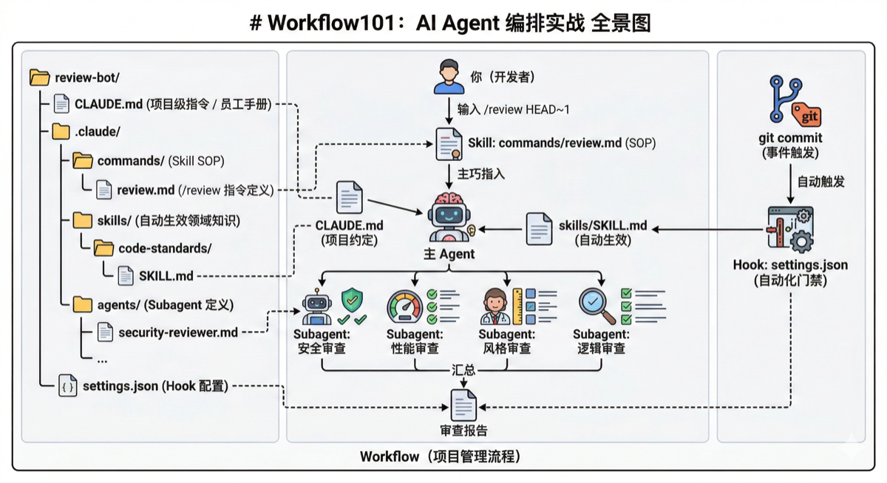
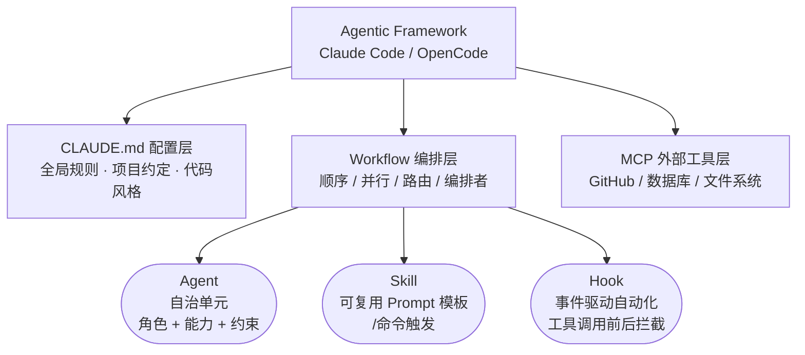

# Workflow101：AI Agent 工作流编排实战

> workflow并不复杂，就是agent间协作罢了，别被那些花里胡哨的术语吓到了
> 本教程希望所有同学都能熟练使用ai，能创建适合自己、适合部门的agent、workflow

> PS: 一个疑问，为什么距离“人人用AI”发文过去了这么久，公司内部都没有能够方便使用的模型？

## 这是什么？

这是一个项目驱动的教程。我们会从零开始，用 Claude Code 构建一个真实的 **Code Review Automator** —— 一个能自动分析 git diff、并行调度多个审查 agent、生成结构化报告的 CLI 工具。

## 我们要构建什么？

```
> /review-bot HEAD~1
```

一条 Skill 指令，背后发生的事：

1. 解析 git diff，理解"改了什么"
2. 同时派出 4 个专业审查 agent（安全 / 性能 / 风格 / 逻辑）
3. 收集所有审查结果，生成一份结构化报告
4. 还能在 git commit 时自动触发

听起来不复杂？但要把它做好，你会用到 Claude Code 几乎所有的编排能力。




## 适合谁？

- 刚接触 Claude Code，想快速上手的开发者
- 已经在用，但还停留在"一问一答"模式的人
- 想看看 AI Agent 编排在实际项目中怎么落地的人

## 先看全景：这些概念什么关系？

教程里会反复出现这些术语。别急着记，先建立一个直觉——它们各自是什么，怎么配合。

| 概念 | 一句话 | 类比 |
|------|--------|------|
| Agent | 能自主完成任务的 AI 实体 | 员工 |
| Subagent | 被主 Agent 派出去干活的子 Agent | 员工派出的外包 |
| CLAUDE.md | 项目级指令，Agent 每次对话都会读 | 员工手册 |
| Skill | 可复用的 prompt 模板，用 `/name` 触发 | 标准作业流程（SOP） |
| Hook | 事件驱动的自动化，工具调用前后自动执行 | 门禁系统 |
| Workflow | 把以上所有东西编排起来协同工作 | 项目管理流程 |

它们之间的关系：

```
你（开发者）
 │
 ├─ 输入 /review-bot HEAD~1
 │     │
 │     ▼
 │  skills/review-bot/SKILL.md（Skill: 定义审查步骤）
 │     │
 │     ▼
 │  主 Agent ◄── CLAUDE.md（项目约定）
 │     │     ◄── skills/SKILL.md（领域知识，自动生效）
 │     │
 │     ├──→ Subagent: 安全审查
 │     ├──→ Subagent: 性能审查
 │     ├──→ Subagent: 风格审查
 │     └──→ Subagent: 逻辑审查
 │                │
 │                ▼
 │           汇总 → 审查报告
 │
 └─ git commit → Hook（settings.json）→ 自动触发审查
```

对应到文件系统：

```
review-bot/
├── CLAUDE.md                    # Agent 的"员工手册"
└── .claude/
    ├── commands/                # Skill: 你触发的 SOP
    │   └── review.md           #   /review-bot → 并行审查+生成报告
    ├── skills/                  # 领域知识: Claude 自动应用
    │   └── code-standards/
    │       └── SKILL.md        #   代码规范、安全规则
    ├── agents/                  # Subagent: 专家角色定义
    │   ├── security-reviewer.md
    │   └── ...
    └── settings.json            # Hook: commit 后自动触发审查
```

一句话总结：**Skill 定义"做什么"，Agent 负责"怎么做"，CLAUDE.md 规定"按什么规矩做"，Hook 决定"什么时候自动做"。**

## 教程结构

每章三段式：**设计思维**（为什么这样做）→ **实操复现**（跟着做）→ **提炼模板**（带走复用）

| 章节 | 你在构建什么 | 学到的编排模式 |
|------|-------------|---------------|
| Ch0: 工具选型 | 了解 AI Coding Agent 全景 | — |
| Ch1: 需求分析 | 用 AI 规划整个项目 | Plan Agent |
| Ch2: 搭建脚手架 | CLI 框架 + CLAUDE.md | Sequential Workflow |
| Ch3: 解析 Git Diff | Git diff 解析模块 | Explore Agent |
| Ch4: Agent 设计 | 4 个专业审查 agent | Agent Design |
| Ch5: Fan-out/Fan-in | 4 agent 同时工作 | Parallel + Fan-out/Fan-in |
| Ch6: 结果聚合 | 结构化审查报告 | Result Aggregation |
| Ch7: Hooks 与 Skills | Hook 自动触发审查 | Hooks + Skills |
| Ch8: 测试驱动 | 测试与 CI 集成 | Test Workflow |
| Ch9: 六种编排模式 | 可复用 workflow 模板 | Pattern Summary |
| 附录: 课后作业 | 4 个 Workflow 实战 | 综合实战 |

## 技术栈

- Python 3.10+
- [typer](https://typer.tiangolo.com/) — CLI 框架
- [Claude Code](https://docs.anthropic.com/en/docs/claude-code) — AI 编排引擎
- Git — 变更分析数据源

## 前置要求

- macOS / Linux / Windows WSL
- Node.js 18+（安装 Claude Code 用）
- Python 3.10+（构建项目用）
- Anthropic API key 或 Claude Pro/Max 订阅
- 基本的命令行和 Git 操作能力

---

## 目录

- [先看全景：这些概念什么关系？](#_4)
- [Ch0: 工具选型 — Claude Code、Cursor、Copilot 怎么选](#ch0-claude-codecursorcopilot)
  - [0.1 什么是 AI Coding Agent？](#01-ai-coding-agent)
  - [0.2 主流 AI Coding Agent 一览](#02-ai-coding-agent)
  - [0.3 AI 时代的开发模式](#03-ai)
  - [0.4 核心概念速览](#04)
  - [0.5 Claude Code 快速安装](#05-claude-code)
- [Ch1: 需求分析 — 用 Plan Agent 想清楚再动手](#ch1-plan-agent)
  - [1.2 为什么要用 AI 做规划？](#12-ai)
  - [1.3 实操复现：规划 Code Review Automator](#13-code-review-automator)
  - [1.4 提炼模板：AI 辅助规划的通用流程](#14-ai)
  - [1.5 规划的常见误区](#15)
- [Ch2: 搭建脚手架 — CLAUDE.md + CLI 一步到位](#ch2-claudemd-cli)
  - [2.2 CLAUDE.md 的三层配置](#22-claudemd)
  - [2.3 实操复现：搭建 Review Bot 脚手架](#23-review-bot)
  - [2.4 顺序工作流](#24-sequential-workflow)
  - [2.5 上下文管理](#25)
  - [2.6 提炼模板：CLAUDE.md 配置模板](#26-claudemd)
- [Ch3: 解析 Git Diff — 用 Explore Agent 读懂变更](#ch3-git-diff-explore-agent)
  - [3.2 Explore Agent 是什么？](#32-explore-agent)
  - [3.3 实操复现：实现 Git Diff 解析](#33-git-diff)
  - [3.4 提炼模板：Explore Agent 使用模式](#34-explore-agent)
- [Ch4: Agent 设计 — 安全、性能、风格、逻辑四个专家](#ch4-agent)
  - [4.2 Agent = 角色 + 能力 + 约束](#42-agent)
  - [4.3 实操复现：定义四个审查 Agent](#43-agent)
  - [4.4 检查清单精度 vs. LLM 泛化能力](#44-vs-llm)
  - [4.5 提炼模板：Agent Prompt 设计模板](#45-agent-prompt)
- [Ch5: Fan-out/Fan-in — 四个 Agent 同时开工](#ch5-fan-outfan-in-agent)
  - [5.2 Claude Code 的并行执行机制](#52-claude-code)
  - [5.3 实操复现：实现并行审查调度](#53)
  - [5.4 提炼模板：Fan-out / Fan-in 模式](#54-fan-out-fan-in)
- [Ch6: 结果聚合 — 把散装结果变成一份正经报告](#ch6)
  - [6.2 结果聚合的三个层次](#62)
  - [6.3 实操复现：实现报告生成器](#63)
  - [6.4 提炼模板：结果聚合模式](#64)
- [Ch7: Hooks 与 Skills — commit 时自动触发审查](#ch7-hooks-skills-commit)
  - [7.2 Hooks 是什么？](#72-hooks)
  - [7.3 实操复现：配置自动审查流水线](#73)
  - [7.4 提炼模板：自动化流水线模式](#74)
- [Ch8: 测试驱动 — 谁来审查审查者？](#ch8)
  - [8.2 验证优先](#82)
  - [8.3 测试策略](#83)
  - [8.4 实操复现：为 Review Bot 添加测试](#84-review-bot)
  - [8.5 提炼模板：测试工作流模式](#85)
- [Ch9: 六种编排模式 — 从一个项目到一套方法论](#ch9)
  - [9.2 模式总结](#92)
  - [9.3 模式组合：Review Bot 的完整编排](#93-review-bot)
- [附录: 课后作业 — Workflow 实战](#workflow)
  - [作业 1：Develop Workflow](#1develop-workflow)
  - [作业 2：Test Workflow](#2test-workflow)
  - [作业 3：Security Audit Workflow](#3security-audit-workflow)
  - [作业 4：Compliance Test Workflow](#4compliance-test-workflow)

---

# Ch0: 工具选型 — Claude Code、Cursor、Copilot 怎么选

> 在动手之前，先看看这个江湖里都有谁。

**术语**

- CLI（Command Line Interface，命令行界面）
- LLM（Large Language Model，大语言模型）
- MCP（Model Context Protocol，模型上下文协议）
- TUI（Terminal User Interface，终端用户界面）
- LSP（Language Server Protocol，语言服务器协议）
- API（Application Programming Interface，应用编程接口）
- TDD（Test-Driven Development，测试驱动开发）
- PRD（Product Requirements Document，产品需求文档）
- SDD（Spec-Driven Development，规格驱动开发）
- CRUD（Create/Read/Update/Delete，增删改查）

## 场景引入

你刚听说"AI 写代码"这件事，打开搜索引擎一查——好家伙，Claude Code、Codex CLI、Gemini CLI、OpenCode，还有一堆叫 Something-Claw 的东西。每个都说自己能帮你写代码，每个看起来都差不多。

别慌。这一章帮你理清楚：这些工具是什么，它们之间有什么区别，以及为什么选 Claude Code 来构建这个教程的项目。

---

## 0.1 什么是 AI Coding Agent？

先搞清楚一个概念：AI Coding Agent ≠ ChatGPT 聊天框里写代码。

**聊天式 AI**：你问它一个问题，它给你一段代码，你复制粘贴到编辑器里。一来一回，像发微信。

**AI Coding Agent**：它能直接操作你的文件系统——读代码、改代码、跑命令、装依赖。你给它一个任务，它自己规划步骤、自己执行、遇到问题自己调整。像一个坐在你旁边的程序员，而不是一个聊天窗口。

关键区别在于 **自主性**：Agent 能自己决定下一步做什么，而不是等你一步步指挥。

```
聊天式 AI:  你说 → AI 回复 → 你复制 → 你粘贴 → 你运行 → 出错 → 你再问
AI Agent:   你说 → Agent 读代码 → Agent 改代码 → Agent 跑测试 → Agent 修 bug → 搞定
```

---

## 0.2 主流 AI Coding Agent 一览

> 数据截至 2026 年 2 月。版本号和功能状态会随时间变化，以各工具官方文档为准。

### 0.2.1 总览

| 工具 | 出品方 | 形态 | 底层模型 | 核心卖点 |
|------|--------|------|----------|----------|
| **Claude Code** | Anthropic | CLI (v2.1.x) | Claude Opus 4.6 | Agent 编排最完整（subagent 并行、Hooks、Skills） |
| **Codex CLI** | OpenAI | CLI (v0.101.x) + 桌面端 + IDE | GPT-5.3-Codex | 沙箱隔离（Docker + approval modes） |
| **Gemini CLI** | Google | CLI (v0.27+) | Gemini 3 Flash / Pro | 超长上下文（Pro 2M / Flash 1M token） |
| **OpenCode** | SST (开源) | CLI (v1.2.x) + 桌面端 + IDE | 75+ 后端可选 | 模型无关 + LSP 深度集成 |
| **Aider** | 社区 (开源) | CLI (v0.86.x) | 多模型可选 | 深度 Git 集成 + Repo Map |

### 0.2.2 编排能力对比

这张表是选型的关键——本教程教的就是这些能力：

| 能力 | Claude Code | Codex CLI | Gemini CLI | OpenCode | Aider |
|------|:-----------:|:---------:|:----------:|:--------:|:-----:|
| Subagent 并行 | ✅ 原生 | ✅ Codex App | ⚠️ 实验性 | ✅ 原生 | ❌ |
| Hooks 自动化 | ✅ | ❌ | ✅ | ✅ | ❌ |
| Skills 自定义命令 | ✅ | ✅ | ✅ | ✅ | ❌ |
| MCP 协议 | ✅ 3000+ 服务 | ✅ | ✅ | ✅ | ⚠️ AiderDesk |
| 沙箱隔离 | ❌ | ✅ | ✅ | ❌ | ❌ |
| 项目配置文件 | CLAUDE.md | AGENTS.md | GEMINI.md | AGENTS.md | .aider.conf.yml |

### 0.2.3 各工具速写

**商业产品**

- **Claude Code** — 通过 Task tool 派出 `Explore`（只读）/ `Plan`（方案）/ `general-purpose`（通用）三类 subagent，支持同一消息内多 agent 并行。MCP 已接入 3000+ 外部服务。CLAUDE.md 支持全局 → 项目 → 目录三层覆盖。Opus 4.6 支持 1M token 上下文（beta）。**本教程的主角。**
- **Codex CLI** — GPT-5.3-Codex 比前代快 25%。三档自动化：suggest / auto-edit / full-auto。Codex App（2026 年 2 月发布）支持多 agent 并行、Git worktree 隔离。MCP 既能当 client 也能当 server。
- **Gemini CLI** — Gemini 3 Pro 的 2M token 上下文窗口是目前最大的。自定义命令（`.toml`）和 Hooks 已稳定；subagent 仍为实验性功能（需手动开启 `experimental.enableAgents`，并行执行尚未实现）。免费额度充裕（每天最多 1000 次请求）。

**开源项目**

- **OpenCode** — SST 团队维护（仓库 sst/opencode，早期 opencode-ai/opencode 已归档）。Go 编写，Bubble Tea TUI 界面。深度集成 LSP，能像编译器一样理解代码结构。内置 General + Explore 两类 subagent，支持并行执行；也支持通过 `.opencode/agents/*.md` 自定义 agent。Skills（`SKILL.md`）和 Hooks（插件体系）均已稳定。项目指令文件为 `AGENTS.md`。除 CLI 外已推出桌面端和 IDE 扩展（VS Code、Cursor）。
- **Aider** — 老牌 AI pair programming 工具。每次修改自动 commit，`/undo` 一键回滚。独创 Repo Map（基于 tree-sitter）让 LLM 看到整个仓库的函数签名。不支持原生 subagent 和 hooks。

**个人 AI Agent**（不只是编程工具）

- **OpenClaw** — 180K+ GitHub Stars，能自主执行日常任务（邮箱、消息、预订），支持 WhatsApp / Telegram。基于 Claude 模型。⚠️ 曾曝出严重 CVE，创始人已加入 OpenAI。
- **NanoClaw** — OpenClaw 轻量替代（12K+ Stars），容器级隔离（Apple Containers / Docker），基于 Claude Agent SDK。
- **NanoBot** — MCP Agent 框架，YAML/JSON 定义 agent，通过 MCP 协议暴露为 Server。

### 0.2.4 为什么选 Claude Code？

不是因为它"最好"——每个工具都有自己的甜区。选它是因为它的 **agent 编排能力最完整**：原生支持 subagent、并行执行、hooks、skills、MCP。这些正是这个教程要教的东西。用其他工具，你得自己搭很多基础设施；用 Claude Code，这些都是开箱即用的。

### 0.2.5 想用 OpenCode 替代？

如果你更倾向开源方案，OpenCode 是最接近的替代品。它支持 MCP、Hooks、多模型后端，而且免费。但概念体系和 Claude Code 不完全对齐，迁移时需要注意映射关系：

| Claude Code 概念 | OpenCode 对应 | 差异说明 |
|------------------|--------------|---------|
| CLAUDE.md | AGENTS.md | 功能类似，都是项目级指令文件 |
| Skills（`.claude/skills/*/SKILL.md`） | Skills（`.opencode/skills/*/SKILL.md`） | 两者格式已趋同：都用目录 + SKILL.md + YAML frontmatter |
| Agents（`.claude/agents/*.md`） | Agents（`.opencode/agents/*.md`） | 两者都支持 Markdown 定义自定义 agent，格式略有不同（YAML frontmatter） |
| Hooks（`.claude/settings.json`） | Plugins（`opencode.json`） | OpenCode 用 JS/TS 插件体系实现 hooks，比 JSON 配置更灵活 |
| Task tool（Subagent 并行） | 原生 subagent | 内置 General subagent 支持并行执行 |
| MCP | MCP | 两者都完整支持，配置方式不同 |
| Plan Mode（Shift+Tab） | 无直接对应 | 可通过 prompt 指令模拟（"只分析不修改"） |

实际迁移策略：

- **Python 工具层**（diff 解析、报告生成）：零修改，跟 AI 工具无关
- **编排层**（Skill 文件）：改写为 prompt 模板或 shell 脚本，手动调度 agent
- **Agent 层**（角色定义）：将 `.md` 中的 prompt 直接粘贴到 OpenCode 对话中使用

> 💡 **Tip**: 本教程的 Python 代码和架构思想是通用的，不绑定任何特定工具。即使你用 Aider、Gemini CLI 甚至纯 API 调用，核心的 fan-out/fan-in 模式和 agent 设计原则都适用。工具只是载体，编排思维才是重点。

---

## 0.3 AI 时代的开发模式

工具选好了，但怎么用？AI Coding Agent 的出现催生了一批新的开发模式。有些是全新的，有些是经典方法论的 AI 增强版。

### 0.3.1 Vibe Coding（氛围编程）

2025 年 2 月，Andrej Karpathy（OpenAI 联合创始人、前 Tesla AI 负责人）发了一条推文，创造了这个词：

> "fully give in to the vibes, embrace exponentials, and forget that the code even exists"

简单说就是：用自然语言描述你想要什么，AI 生成代码，你不用看懂每一行，只要结果能跑就行。不断迭代，直到满意。

```
你: "帮我做一个待办事项 App"
AI: [生成 200 行代码]
你: "加个深色模式"
AI: [修改代码]
你: "不错，部署吧"
```

**优点**: 上手极快，适合原型验证和个人项目。
**风险**: 代码质量不可控，安全隐患多，不适合生产环境。你可能连自己的代码做了什么都不知道。

**适用场景**: 快速原型、hackathon、个人小工具。

### 0.3.2 TDD with AI（AI 辅助测试驱动开发）

经典 TDD 的流程是 Red → Green → Refactor：先写一个失败的测试，再写最少的代码让它通过，最后重构。

AI Agent 让这个循环变得更高效：

```
1. 你写测试（或让 AI 帮你写）
2. AI Agent 写代码让测试通过
3. 测试失败 → Agent 自动分析错误 → 修复 → 重跑
4. 全部通过 → 重构
```

在 Claude Code 中，你可以用 Hook 实现自动化 TDD 循环——每次代码修改后自动跑测试，失败了 agent 自动修复。这就是 Ch8 会详细讲的内容。

**核心价值**: 测试是"安全网"。有了测试，你可以放心让 AI 大刀阔斧地改代码，因为测试会告诉你有没有改坏东西。

**适用场景**: 任何需要代码质量保障的项目，尤其是多人协作和长期维护的项目。

### 0.3.3 Spec-Driven Development（规格驱动开发）

Vibe Coding 的反面。核心思想：**先写详细的规格说明（Spec），再让 AI 按规格实现**。

```
1. 人类写 Spec（需求文档、接口定义、验收标准）
2. AI 读取 Spec，理解意图
3. AI 按 Spec 逐步实现
4. 用 Spec 中的验收标准验证结果
```

Spec 可以是 Markdown 文档、JSON Schema、甚至是 CLAUDE.md 中的规则。关键是：**Spec 是 single source of truth**，AI 的所有行为都以 Spec 为准。

**优点**: 结果可预测，质量可控，适合团队协作。
**代价**: 前期需要花时间写 Spec，但这个时间会在后面省回来。

**适用场景**: 团队项目、生产环境、需要可审计性的场景。

### 0.3.4 Ralph Loop（自主循环开发）

Ralph（得名于《辛普森一家》的 Ralph Wiggum）是一种让 AI Agent **自主循环运行直到任务完成**的模式。

工作原理：

```
1. 人类写 PRD（产品需求文档），拆成 checklist
2. Agent 启动，读取 PRD
3. Agent 选一个未完成的任务 → 实现 → 测试 → 提交
4. Agent 停止（上下文用完或主动退出）
5. 自动重启，带着全新上下文继续下一个任务
6. 重复 3-5，直到 checklist 全部完成
```

关键设计：**文件系统就是记忆**。每次重启时 agent 的上下文是全新的，但代码库、PRD 文件、进度记录都在磁盘上。Agent 通过读取这些文件来恢复状态。

```
while not all_tasks_done:
    agent = start_fresh_agent()
    agent.read("prd.json")        # 读取需求
    agent.read("progress.md")     # 读取进度
    task = agent.pick_next_task() # 选择下一个任务
    agent.implement(task)         # 实现
    agent.test(task)              # 测试
    agent.commit(task)            # 提交
    agent.update("progress.md")  # 更新进度
```

**优点**: 能处理大型项目，不受上下文窗口限制，可以"过夜运行"。
**风险**: 需要清晰的 PRD 和验收标准，否则 agent 会在错误方向上越跑越远。

**适用场景**: 功能明确的中大型项目、批量 CRUD 开发、夜间自动化构建。

### 0.3.5 Plan-then-Code（先规划后编码）

Claude Code 的 Plan Mode 就是这种模式的典型实现：

```
1. 进入 Plan Mode（只读，不能改代码）
2. Agent 探索代码库，理解现状
3. Agent 制定实施方案
4. 人类审核方案，提出修改
5. 方案确认后，退出 Plan Mode
6. Agent 按方案执行
```

和 Spec-Driven 的区别：Spec-Driven 是人写规格、AI 执行，Plan-then-Code 是 **AI 写方案、人审核**。更适合你对代码库不够熟悉、需要 AI 帮你分析的场景。

**适用场景**: 接手新项目、复杂重构、不确定最佳方案时。

### 0.3.6 模式对比

| 模式 | 谁主导 | 前期投入 | 质量可控性 | 适合场景 |
|------|--------|---------|-----------|---------|
| Vibe Coding | AI | 极低 | 低 | 原型、个人项目 |
| TDD with AI | 人+AI | 中 | 高 | 需要质量保障的项目 |
| Spec-Driven | 人 | 高 | 高 | 团队、生产环境 |
| Ralph Loop | AI | 高（写 PRD） | 中 | 批量开发、夜间构建 |
| Plan-then-Code | AI+人 | 低 | 中 | 探索性任务、重构 |

> 💡 **这些模式不是互斥的。** 实际项目中你往往会混合使用：先用 Plan-then-Code 理解现状，再用 Spec-Driven 定义需求，开发时用 TDD 保障质量，简单的部分直接 Vibe Coding。Review Bot 教程就是这种混合模式的实践。

---

## 0.4 核心概念速览

在正式开始构建项目之前，有几个概念需要先对齐。不用死记，后面每章用到时会反复强化。

### 0.4.1 Agent

一个能自主完成任务的 AI 实体。三要素：

- **角色**（Role）：它是谁？安全审查专家？性能优化师？
- **能力**（Capability）：它能用什么工具？能读文件？能跑命令？
- **约束**（Constraint）：它不能做什么？不能删文件？只能看不能改？

打个比方：Agent 就像公司里的员工。你不会让前台去写代码，也不会让程序员去谈客户。每个人有自己的职责范围。

### 0.4.2 Subagent

主 Agent 派出去执行特定子任务的"下属"。在 Claude Code 中，通过 `Task` tool 创建。

关键特性：**上下文隔离**。Subagent 有自己独立的对话上下文，不会污染主 Agent 的上下文窗口。就像你派实习生去调研一个技术方案——他去查资料、写报告，最后只把结论带回来，不会把他查过的 100 篇文章都塞进你的脑子里。

Claude Code 通过 Task tool 的 `subagent_type` 参数指定 subagent 类型：
- **Explore**：只读探索代码库（只能用 Glob/Grep/Read，不能修改文件）
- **Plan**：方案设计（只读分析，输出实施计划）
- **general-purpose**：通用型，能读写文件、执行命令，什么都能干

### 0.4.3 Context Window（上下文窗口）

Agent 的"工作记忆"。所有的对话历史、读过的代码、工具调用结果，都会占用上下文窗口的空间。

Claude Code 的上下文窗口大小取决于底层模型（Opus 4.6 已支持 1M token beta）。听起来很大，但读几个大文件就能吃掉一大半。这就是为什么 subagent 的上下文隔离那么重要——你不想让一个探索任务把主 agent 的记忆撑爆。上下文快满时可以手动执行 `/compact` 释放空间。

### 0.4.4 MCP（Model Context Protocol）

一套标准协议，让 AI Agent 能连接外部工具和数据源。

没有 MCP 之前，每个 AI 工具想接 GitHub 就得自己写一套 GitHub 集成，想接数据库又得写一套。有了 MCP，就像 USB 接口一样——只要工具实现了 MCP 协议，任何支持 MCP 的 Agent 都能直接用。

在 Claude Code 中，你可以通过 `claude mcp add` 命令添加 MCP Server，瞬间获得新能力（比如直接操作 GitHub PR、查询数据库）。

### 0.4.5 Workflow / Orchestration（工作流 / 编排）

把多个 Agent 按照一定的逻辑组织起来，协同完成一个复杂任务。

这就是本教程的核心主题。单个 Agent 能力有限，但当你学会编排——让它们串行、并行、条件分支、循环——就能处理远超单个 Agent 能力范围的任务。

常见的编排模式：

```
顺序执行:
     A ──→ B ──→ C

并行执行:
          ┌── B ──┐
     A ───┤       ├──→ D
          └── C ──┘

条件分支:
          ┌─ yes ─→ B
     A ───┤
          └─ no ──→ C

Fan-out/Fan-in:
     A ───┬── B1 ──┬──→ C（汇总）
          ├── B2 ──┤
          ├── B3 ──┤
          └── B4 ──┘
```

Code Review Automator 会用到所有这些模式。

### 0.4.6 Agentic 概念层次图

上面介绍的 Agent、Skill、Hook、MCP 等概念，它们之间是什么层级关系？

```
Agentic Framework (Claude Code / OpenCode)
│
├── CLAUDE.md 配置层
│   全局规则、项目约定、代码风格
│
├── Workflow 编排层
│   顺序 / 并行 / 路由 / 编排者等模式
│   │
│   ├── Agent   自治单元 (角色 + 能力 + 约束)
│   ├── Skill   可复用 Prompt 模板 (/命令触发)
│   └── Hook    事件驱动自动化 (工具调用前后拦截)
│
└── MCP 外部工具层
    GitHub / 数据库 / 文件系统等外部能力
```



### 0.4.7 各层职责速查表

| 层级 | 是什么 | 放在哪 | 触发方式 |
|------|--------|--------|---------|
| Workflow | 多步骤任务的编排模式（顺序、并行、路由…） | Skill 文件中编排，或 CLAUDE.md 中描述 | 用户指令或 Skill 触发 |
| Agent | 有角色、能力、约束的自治单元 | `.claude/agents/*.md` | 被 Skill 或主 Agent 作为 subagent 调用 |
| Skill | 可复用的 prompt 模板 | `.claude/skills/*/SKILL.md` | 用户输入 `/skill-name` |
| Hook | 事件驱动的自动化规则 | `.claude/settings.json` | 工具调用前后自动触发 |
| MCP | 外部工具协议（GitHub、DB、FS…） | `.claude/settings.json` 或全局配置 | Agent/Skill 需要外部能力时自动调用 |
| CLAUDE.md | 项目级规则和约定 | 项目根目录 `CLAUDE.md` | 每次会话自动加载 |

### 0.4.8 在 Review Bot 中的对应

把这个层次映射到我们即将构建的项目：

```
Review Bot 概念映射：

Workflow    → /review-bot skill 编排的 4 步流程
              (get diff → fan-out agents → fan-in → report)

Agent       → 4 个审查 agent（安全/性能/风格/逻辑）
              定义在 .claude/agents/*.md

Skill       → /review-bot 命令
              定义在 .claude/skills/review-bot/SKILL.md

Hook        → commit 后自动提示、写文件后自动测试
              配置在 .claude/settings.json

MCP         → 本项目暂不使用（纯本地 git 操作）

CLAUDE.md   → 项目规则、代码风格、三层架构说明
```

> 💡 **Tip**: 搞清楚概念层次，后面写代码时就不会纠结"这段逻辑该放 Python 里还是放 Skill 里"。经验法则：**可测试的数据处理放 Python，LLM 编排放 Skill，专业角色放 Agent，自动化触发放 Hook**。

---

## 0.5 Claude Code 快速安装

既然选定了工具，先把它装上。

```bash
# Install Claude Code (requires Node.js 18+)
npm install -g @anthropic-ai/claude-code

# Verify installation
claude --version

# Start Claude Code
claude
```

首次启动会要求你登录 Anthropic 账号或配置 API key。按提示操作即可。

> ⚠️ **注意**: Claude Code 需要 Node.js 18 或更高版本。如果你还没装 Node.js，推荐用 [nvm](https://github.com/nvm-sh/nvm) 管理版本。

---

## 0.6 小结

工具选好了，概念对齐了，下一章开始真正动手——先想清楚再写代码。

---

# Ch1: 需求分析 — 用 Plan Agent 想清楚再动手

> 写代码之前最重要的事：想清楚要做什么。

**术语**

- Plan Mode（规划模式，Claude Code 的只读规划状态）
- PR（Pull Request，合并请求）
- Subagent（子代理，主 Agent 派出的下属）
- Dataclass（Python 数据类，用装饰器自动生成样板代码）
- Fan-out/Fan-in（扇出/扇入，并行分发再汇总的模式）

## 1.1 场景引入

你接到一个需求："做一个自动代码审查工具"。

大多数人的第一反应是打开编辑器开始写代码。然后写到一半发现架构不对，推倒重来。再写到一半发现需求理解错了，又推倒重来。

如果你有一个 AI 助手，能在动手之前帮你把需求拆清楚、架构想明白、任务排好序呢？

这就是 Claude Code 的 **Plan Agent** 能做的事。

---

## 1.2 为什么要用 AI 做规划？

### 1.2.1 规划的价值

软件开发中，最贵的不是写代码，而是**写错代码**。返工的成本远高于多花点时间想清楚。

传统做法：你自己写 PRD、画架构图、拆任务。这些都是你的经验在驱动。

AI 辅助做法：你描述目标，AI 帮你补盲点。它见过的项目比你多，能提醒你"这里通常会有坑"。

> 让 AI 帮你补盲点，最终拍板的还是你。

### 1.2.2 Claude Code 的 Plan 模式

Claude Code 有一个内置的 Plan 模式。当你面对一个复杂任务时，可以让它先进入"规划模式"——只思考、不动手。

**怎么进入 Plan 模式？**

在 Claude Code 的输入框中按 `Shift+Tab`，会在三种模式之间循环切换：

```
Normal Mode → Auto-accept Edits → Plan Mode → Normal Mode → ...
```

当底部状态栏显示 `⏸ plan mode on` 时，就进入了 Plan 模式。

**Plan 模式下能做什么？**

| 能做 | 不能做 |
|------|--------|
| 读取文件、搜索代码 | 创建、编辑、删除文件 |
| 派出 Explore subagent 分析架构 | 执行修改性的 shell 命令 |
| 搜索网页、获取文档 | 安装依赖包 |
| 向你提问、澄清需求 | 任何会改变代码库的操作 |
| 创建和管理任务列表 | |

这个"只读"约束很重要——它保证了 AI 在规划阶段不会"手痒"偷偷改你的代码。

**怎么退出？**

再按一次 `Shift+Tab` 切回 Normal Mode。确认方案后，在 Normal Mode 下让 AI 按方案执行。

> 💡 **Tip**: 你也可以不用 Plan 模式的快捷键，直接在 prompt 里说"请先帮我规划，不要写代码"。效果类似，但 Plan 模式的硬约束更可靠——它从工具层面禁止了写操作，而不是靠 AI 的"自觉"。

Plan 模式下，Claude Code 会：
1. 分析你的需求
2. 探索相关代码（如果已有代码库）
3. 设计实现方案
4. 列出具体步骤
5. 等你确认后再执行

这和直接让它"帮我写个 XXX"有本质区别。后者是边想边做，前者是想清楚再做。这就是 Ch0 中提到的 **Plan-then-Code** 开发模式的实践。

---

## 1.3 实操复现：规划 Code Review Automator

### Step 1: 启动 Claude Code 并描述项目

打开终端，创建项目目录：

```bash
mkdir -p ~/projects/review-bot && cd ~/projects/review-bot
claude
```

进入 Claude Code 后，输入：

```
我想构建一个 Code Review Automator CLI 工具。
功能：分析本地 git diff，用多个专业 agent 并行审查（安全、性能、风格、逻辑），生成结构化报告。
技术栈：Python + typer。
请先帮我规划，不要写代码。
```

### Step 2: 审视 AI 给出的规划

Claude Code 通常会给出类似这样的规划：

```
项目结构：
review_bot/
├── cli.py          # CLI entry point (typer)
├── diff_parser.py  # Git diff parsing
├── agents/
│   ├── security.py # Security review agent
│   ├── performance.py
│   ├── style.py
│   └── logic.py
├── reporter.py     # Report generation
└── config.py       # Configuration

实现步骤：
1. 搭建 CLI 框架（typer）
2. 实现 git diff 解析
3. 设计审查 agent prompt
4. 实现并行审查调度
5. 实现报告生成
6. 添加 hook 自动触发
```

这个规划看起来不错，但有几个问题值得追问：

```
几个问题：
1. diff 解析要支持哪些格式？只支持 unified diff 还是也要支持 stat？
2. agent 之间需要共享上下文吗？比如安全 agent 发现的问题，逻辑 agent 需要知道吗？
3. 报告输出什么格式？纯文本？Markdown？JSON？
4. 错误处理策略是什么？一个 agent 挂了，其他的继续还是全部停？
```

> ⚠️ **踩坑提醒**: 不要无脑接受 AI 的第一版规划。它给的是"通用最佳实践"，不一定适合你的具体场景。你的工作是**追问细节**和**做取舍**。

### Step 3: 迭代细化

好的规划不是一轮就能定的。你需要和 AI 来回几轮，逐步收敛：

```
你: agent 之间需要共享上下文吗？比如安全 agent 发现了 buffer overflow，
    逻辑 agent 需要知道这件事吗？

AI: 建议不共享。共享会引入依赖（安全 agent 必须先跑完），误判会传染，
    且独立运行才能并行。代价是少量重复发现，汇总阶段去重即可。

你: 同意。那如果一个 agent 挂了呢？

AI: 建议部分失败继续，在报告中标注哪个 agent 失败了。
    3 个 agent 的审查结果总比 0 个好。

你: 选这个。四个 agent 的输出格式需要统一吗？

AI: 强烈建议统一为 5 个字段：severity / file / line / description / suggestion。
    severity 分 3 级：critical（必须修复）/ warning（建议修复）/ info（可选改进）。
    报告的最终 verdict 基于最高 severity 决定。

你: 好，就这样。
```

经过几轮追问，确定了以下设计决策：

| 决策点 | 选择 | 理由 |
|--------|------|------|
| Diff 格式 | unified diff | 信息最完整，包含上下文行 |
| Agent 间通信 | 不共享 | 保持独立性，避免级联错误 |
| 报告格式 | Markdown + JSON | Markdown 给人看，JSON 给程序用 |
| 错误处理 | 部分失败继续 | 一个 agent 挂了不影响其他审查 |
| CLI 框架 | typer | 类型安全，自动生成帮助文档 |
| 输出格式 | 统一 5 字段 | severity / file / line / description / suggestion |
| 严重程度 | 3 级 | critical / warning / info |

### Step 4: 确认最终架构

让 Claude Code 根据讨论结果画出最终架构：

```
请根据讨论结果，画出最终的系统架构图（ASCII）和确认项目结构。
```

最终架构：

```
┌───────────────────────────────────────────┐
│              CLI (typer)                   │
│           /review-bot                     │
└─────────────────────┬─────────────────────┘
                      │
                      ▼
┌───────────────────────────────────────────┐
│             Diff Parser                    │
│       git diff → structured data           │
└─────────────────────┬─────────────────────┘
                      │
        ┌─────────┬───┴───┬─────────┐
        ▼         ▼       ▼         ▼
   ┌────────┐ ┌──────┐ ┌───────┐ ┌───────┐
   │Security│ │ Perf │ │ Style │ │ Logic │
   │ Agent  │ │Agent │ │ Agent │ │ Agent │
   └───┬────┘ └──┬───┘ └───┬───┘ └──┬────┘
       └─────────┴────┬────┴─────────┘
                      │
                      ▼
┌───────────────────────────────────────────┐
│              Reporter                      │
│      aggregate → markdown / json           │
└───────────────────────────────────────────┘
```

### Step 5: 用工具能力快速理解 Agentic 概念层次

规划项目架构之前，还有一件事值得做：**搞清楚你用的工具本身的概念体系**。

Claude Code / OpenCode 这类 agentic coding tool 不只是"能聊天的编辑器"。它们有一套完整的层级概念——Framework、Workflow、Agent、Skill、Hook、MCP——搞混了就会把代码放错地方。

好消息是，你可以用工具自身的能力来理解这些概念。

**方法 1：用 Plan 模式提问**

```
请帮我梳理 Claude Code 的概念层次：
- Agentic Framework、Workflow、Agent、Skill、Hook、MCP 分别是什么？
- 它们之间的层级关系和协作方式是怎样的？
- 在一个实际项目中，代码应该放在哪一层？
不要写代码，只给我概念梳理。
```

**方法 2：用 Explore Agent 看真实项目**

```
帮我分析这个项目的 .claude/ 目录结构。
我需要知道：
1. commands/、agents/、skills/ 三个目录各放了什么？
2. settings.json 里配置了哪些 hook？
3. 这些配置是怎么协作的？
```

**方法 3：用 WebSearch 查官方文档**

```
搜索 Claude Code 官方文档中关于 hooks、skills、agents 的说明，
帮我整理成一份对比表。
```

三种方法可以组合使用。Plan 模式给你概念框架，Explore Agent 给你真实案例，WebSearch 补充最新文档。

概念层次图和各层职责速查表见前文 [Agentic 概念层次图](#046-agentic) 一节。

> 💡 **Tip**: 在规划阶段就把概念层次理清，后面写代码时就不会纠结"这段逻辑该放 Python 里还是放 Skill 里"。经验法则：**可测试的数据处理放 Python，LLM 编排放 Skill，专业角色放 Agent，自动化触发放 Hook**。

---

## 1.4 提炼模板：AI 辅助规划的通用流程

不管你做什么项目，都可以套用这个流程：

```
1. 描述目标（不要说"怎么做"，只说"要什么"）
   ↓
2. 让 AI 给出初版规划
   ↓
3. 追问细节（格式？边界？错误处理？）
   ↓
4. 做取舍（记录每个决策的理由）
   ↓
5. 确认最终方案（架构图 + 项目结构 + 实施步骤）
```

### 1.4.1 Prompt 模板

```
我想构建 [项目描述]。
功能需求：[列出核心功能]
技术约束：[技术栈、平台、性能要求等]
请先帮我规划，不要写代码。需要包含：
- 项目结构
- 核心模块划分
- 实施步骤（按优先级排序）
- 你认为需要提前想清楚的设计决策
```

### 1.4.2 决策记录模板

养成记录设计决策的习惯。后面回头看，你会感谢自己的。

```markdown
## 决策：[决策标题]
- 选项 A：[描述] — 优点 / 缺点
- 选项 B：[描述] — 优点 / 缺点
- **选择**：[选了哪个]
- **理由**：[为什么]
```

---

## 1.5 规划的常见误区

### 误区 1：规划等于写 PRD

不需要写一份 20 页的需求文档。AI 辅助规划的重点是**对话式探索**——通过提问和回答逐步收敛方案。一个清晰的架构图 + 一张决策表，比一份冗长的 PRD 更有用。

### 误区 2：一次规划到位

没有人能在第一次就想清楚所有细节。好的规划是**渐进式**的：先定大方向（Ch1），实现过程中遇到新问题再补充。Review Bot 就是这样——Ch1 定了整体架构，但 agent 的具体 prompt 设计是到 Ch4 才细化的。

### 误区 3：AI 说什么就是什么

AI 给的规划基于"通用最佳实践"，但你的项目有自己的约束。比如 AI 可能建议用 asyncio 做并行，但这里选了 Claude Code 的 subagent 并行——因为这是教程的教学目标。**你才是最终决策者**。

### 误区 4：跳过规划直接写代码

"这个需求很简单，不用规划"——这句话是 bug 的温床。哪怕只花 5 分钟让 AI 帮你列一下实施步骤，也比直接开干强。规划的成本远低于返工的成本。

---

## 1.6 小结

架构定了，决策记下来了，下一章开始搭脚手架——把规划变成真正能跑的代码。

---

# Ch2: 搭建脚手架 — CLAUDE.md + CLI 一步到位

> 好的开始是成功的一半。好的 CLAUDE.md 能省掉一半的反复纠正。

**术语**

- CLI（Command Line Interface，命令行界面）
- Linter（代码静态检查工具）
- Docstring（文档字符串，嵌在代码中的说明文本）
- Type Hints（类型提示，Python 的静态类型标注）
- pyproject.toml（Python 项目配置文件，PEP 621 标准）

## 2.1 场景引入

你新招了一个实习生，第一天上班。你会怎么做？

肯定不是直接甩一句"去把代码写了"。你会给他一份入职手册：公司用什么技术栈、代码风格是什么、哪些事情绝对不能做、遇到问题找谁。

CLAUDE.md 就是你给 Claude Code 的"入职手册"。没有它，Claude Code 每次都在猜你的偏好；有了它，它从第一行代码就知道该怎么写。

---

## 2.2 CLAUDE.md 的三层配置

Claude Code 的配置有三个层级，从大到小：

```
~/.claude/CLAUDE.md          ← 全局：你所有项目的通用偏好
项目根目录/CLAUDE.md          ← 项目级：这个项目的规则
子目录/CLAUDE.md              ← 目录级：特定模块的规则
```

就像公司制度：集团有集团的规章，部门有部门的细则，小组有小组的约定。越具体的层级优先级越高。

### 2.2.1 该写什么？

一份好的 CLAUDE.md 回答四个问题：

1. **这个项目是什么？**（技术栈、架构概述）
2. **代码怎么写？**（风格、命名、格式）
3. **什么不能做？**（禁止事项、安全红线）
4. **常用操作是什么？**（测试命令、构建命令、部署流程）

### 2.2.2 快速起步：/init 命令

不想从零写 CLAUDE.md？Claude Code 提供了 `/init` 命令，自动分析你的项目结构并生成初版配置：

```bash
cd ~/projects/review-bot
claude
# 进入 Claude Code 后输入：
/init
```

`/init` 会扫描目录结构、识别编程语言、检测构建系统，然后生成一份 CLAUDE.md。通常两分钟就能得到一个可用的起点，然后你再根据项目实际情况调整。

> 💡 **Tip**: `/init` 生成的是"通用版"，适合快速起步。但项目特有的规则（比如"不要直接 commit 到 main"）还是需要你手动补充。

### 2.2.3 CLAUDE.md 写作反模式

写 CLAUDE.md 也有坑。以下是常见的错误写法和改进建议：

**❌ 太模糊**
```markdown
## Rules
- Write good code
- Follow best practices
```

**✅ 具体可执行**
```markdown
## Rules
- Use type hints on all function signatures
- Max line length: 88 (black default)
- All public functions must have Google-style docstrings
```

**❌ 太长太杂**

把整个项目的 API 文档、数据库 schema、部署手册全塞进 CLAUDE.md。结果文件 2000 行，Claude Code 每次启动都要读一遍，挤占上下文空间。

**✅ 精简聚焦**

CLAUDE.md 只放"AI 写代码时需要知道的规则"。详细文档放在别的地方，需要时让 AI 去读。

**❌ 只有正面规则，没有负面约束**
```markdown
## Style
- Use descriptive variable names
```

**✅ 正反都有**
```markdown
## Style
- Use descriptive variable names
- NEVER use single-letter variables except in list comprehensions
- NEVER use `print()` for logging, use the `logging` module
```

Claude Code 对 "NEVER" 开头的规则特别敏感，遵守率很高。

---

## 2.3 实操复现：搭建 Review Bot 脚手架

### Step 1: 创建 CLAUDE.md

在项目根目录创建 `CLAUDE.md`：

```markdown
# Review Bot — Code Review Automator

## Project Overview
A CLI tool that analyzes local git diffs of C/C++ projects and runs parallel
code reviews using multiple specialized agents. Built with Python and typer.

## Tech Stack
- Python 3.10+
- typer (CLI framework)
- subprocess (git operations)

## Code Style
- Use type hints everywhere
- Docstrings: Google style
- Max line length: 88 (black default)
- Import order: stdlib → third-party → local (isort)

## Architecture
- Python 代码 = 工具层（diff 解析、报告生成）
- `.claude/skills/review-bot/SKILL.md` = 编排层（通过 Claude Code Task tool 调度）
- `.claude/agents/*.md` = Agent 定义（每个 agent 的角色和 prompt）

## Project Structure
review_bot/
├── cli.py           # CLI entry point (diff/report subcommands)
├── diff_parser.py   # Git diff parsing
├── scheduler.py     # Result aggregation utilities
├── reporter.py      # Report generation
└── agents/
    ├── base.py      # Base agent definition
    └── registry.py  # Agent registry

## Commands
- Diff: `review-bot diff [TARGET] [--repo PATH]`
- Skill: `/review-bot HEAD~3` or `/review-bot HEAD~5 --repo /path/to/repo`
- Test: `pytest tests/ -x -q`
- Lint: `ruff check .`
- Format: `black .`

## Rules
- NEVER commit directly to main
- NEVER hardcode file paths
- Always handle subprocess errors gracefully
- Keep each module under 200 lines
```

> 💡 **Tip**: CLAUDE.md 里的 Rules 部分特别重要。Claude Code 会严格遵守这些规则。如果你发现它总是犯同一个错误，把"不要做 XXX"写进 Rules，立竿见影。

### Step 2: 用 Claude Code 搭建 CLI 框架

现在让 Claude Code 来干活。在项目目录中启动 Claude Code：

```bash
cd ~/projects/review-bot
claude
```

输入：

```
请根据 CLAUDE.md 的项目结构，帮我搭建基础的 CLI 框架。
需要：
1. pyproject.toml（用 setuptools）
2. review_bot/cli.py — 用 typer，包含一个 review 命令
3. review_bot/__init__.py
4. 一个能跑通的最小实现
```

Claude Code 会读取 CLAUDE.md，然后按照里面的规范生成代码。你应该会得到类似这样的结果：

**pyproject.toml**:

```toml
[build-system]
requires = ["setuptools>=68.0"]
build-backend = "setuptools.build_meta"

[project]
name = "review-bot"
version = "0.1.0"
requires-python = ">=3.10"
dependencies = [
    "typer>=0.9.0",
]

[project.scripts]
review-bot = "review_bot.cli:app"
```

**review_bot/diff_parser.py**（占位 stub，Ch3 会替换为完整实现）:

```python
"""Git diff parser — stub for CLI scaffolding."""
import subprocess
from dataclasses import dataclass, field


@dataclass
class FileChange:
    """Represents changes to a single file."""
    path: str
    added_lines: list[str] = field(default_factory=list)
    removed_lines: list[str] = field(default_factory=list)


@dataclass
class DiffResult:
    """Parsed diff containing all file changes."""
    files: list[FileChange] = field(default_factory=list)

    @property
    def summary(self) -> str:
        return f"{len(self.files)} files changed"


def get_diff(target: str = "HEAD~1", repo: str | None = None) -> str:
    """Run git diff and return raw output."""
    cmd = ["git", "diff", target]
    result = subprocess.run(cmd, capture_output=True, text=True, cwd=repo)
    if result.returncode != 0:
        raise RuntimeError(f"git diff failed: {result.stderr}")
    return result.stdout


def parse_diff(raw_diff: str) -> DiffResult:
    """Parse unified diff into structured data (minimal stub)."""
    result = DiffResult()
    for line in raw_diff.splitlines():
        if line.startswith("diff --git"):
            path = line.split(" b/")[-1]
            result.files.append(FileChange(path=path))
    return result
```

**review_bot/cli.py**:

```python
"""CLI entry point for Review Bot — utility layer for Claude Code skills."""
import typer

from .diff_parser import get_diff, parse_diff

app = typer.Typer(
    name="review-bot",
    help="Code review utilities — use /review-bot skill for full orchestration.",
)


@app.command()
def diff(
    target: str = typer.Argument("HEAD~1", help="Git diff target (e.g., HEAD~1, main)"),
    repo: str = typer.Option(None, help="Path to git repository (default: cwd)"),
) -> None:
    """Parse git diff and print structured summary."""
    raw_diff = get_diff(target, repo=repo)
    result = parse_diff(raw_diff)
    typer.echo(result.summary)
    typer.echo("---")
    typer.echo(raw_diff)


if __name__ == "__main__":
    app()
```

注意几个细节：
- 用了 type hints（`str`、`-> None`），因为 CLAUDE.md 里要求了
- docstring 用 Google style，也是 CLAUDE.md 的规范
- CLI 定位为**工具层**——只做 diff 解析和报告生成，不做 LLM 编排。编排由 `/review-bot` skill 通过 Claude Code 的 Task tool 完成
- `repo` 参数支持从任意目录审查远程仓库

### Step 3: 验证脚手架

```bash
# Install in development mode
pip install -e .

# Test the CLI
review-bot --help
review-bot HEAD~3
review-bot HEAD~3 --repo /path/to/other/repo
```

如果看到 diff 摘要和原始 diff 输出，说明脚手架搭好了。

> ⚠️ **注意 typer 的单命令行为**: 当前只有一个 `diff` 命令，typer 会自动将它提升为主命令。所以用法是 `review-bot HEAD~3` 而不是 `review-bot diff HEAD~3`。等 Ch6 添加 `report` 子命令后，typer 切换为多命令模式，届时需要改用 `review-bot diff HEAD~3`。

---

## 2.4 顺序工作流（Sequential Workflow）

搭脚手架的过程，其实就是一个**顺序工作流**：

```
创建 CLAUDE.md → 生成项目结构 → 写 CLI 入口 → 安装依赖 → 验证
```

每一步都依赖前一步的结果。这是最简单的编排模式，也是所有复杂模式的基础。

在 Claude Code 中，顺序工作流就是你和 AI 的一问一答：你给指令，它执行，你验证，再给下一个指令。没有并行，没有分支，就是一条直线走到底。

什么时候用顺序工作流？
- 步骤之间有严格依赖（不装依赖就没法跑测试）
- 任务本身不复杂，不需要拆分
- 你需要在每一步之后人工确认

---

## 2.5 上下文管理 — 你最宝贵的资源

Claude Code 的上下文窗口是你最宝贵的资源。**上下文越满，性能越差**——这是官方文档反复强调的核心原则。

### 2.5.1 三个关键命令

| 命令 | 作用 | 什么时候用 |
|------|------|-----------|
| `/clear` | 清空当前对话，重新开始 | 切换到不相关的任务时 |
| `/compact` | 压缩对话历史，保留关键信息 | 上下文快满时（超过 128K） |
| `/rewind` | 回退到之前的对话状态 | 发现走错方向，想回到某个节点 |

### 2.5.2 避免 "Kitchen Sink Session"

最常见的上下文浪费模式：在同一个会话里做一堆不相关的事。

```
❌ 一个会话里：搭脚手架 → 调试 CSS → 写文档 → 查 API → 改配置
✅ 每个独立任务一个会话：搭脚手架 → /clear → 写文档 → /clear → 改配置
```

### 2.5.3 Subagent 是上下文的"防火墙"

这也是为什么 subagent 的上下文隔离那么重要（Ch3 和 Ch5 会详细讲）。Explore Agent 去翻了 100 个文件，这些内容不会出现在主 agent 的上下文里——主 agent 只收到最终结论。

> 💡 **Tip**: 养成习惯——每完成一个阶段性任务，考虑是否需要 `/clear` 或 `/compact`。上下文管理是日常卫生，得主动做。

---

## 2.6 提炼模板：CLAUDE.md 配置模板

```markdown
# [项目名称]

## Project Overview
[一句话描述项目做什么]

## Tech Stack
- [语言和版本]
- [核心依赖]

## Architecture
- [代码层职责说明]
- [编排层职责说明]

## Code Style
- [类型标注要求]
- [文档字符串风格]
- [格式化工具和配置]

## Project Structure
[目录树]

## Commands
- Run: [启动命令]
- Test: [测试命令]
- Lint: [检查命令]

## Rules
- [绝对不能做的事]
- [必须遵守的约定]

## Testing Rules
- [测试执行命令]
- [提交前必须通过测试]
- [新功能必须包含测试]
```

### 2.6.1 顺序工作流模板

```
Step 1: [前置准备] → 验证 ✓
Step 2: [核心操作] → 验证 ✓
Step 3: [后续处理] → 验证 ✓
```

每一步都有明确的输入、输出和验证条件。简单但可靠。

---

## 2.7 小结

CLAUDE.md 写得越具体，后面省的时间越多——这一章的脚手架虽然简单，但它是后续所有章节的地基。上下文管理从现在就要养成习惯，别等窗口撑满再想起来。

---

# Ch3: 解析 Git Diff — 用 Explore Agent 读懂变更

> 审查代码的第一步不是"找 bug"，而是"理解变更"。

**术语**

- Diff（差异，两个版本之间的变更内容）
- Unified Diff（统一差异格式，`git diff` 的标准输出格式）
- Explore Agent（探索代理，Claude Code 的只读代码探索 subagent）
- Dataclass（Python 数据类）
- Subprocess（子进程，Python 中调用外部命令的模块）

## 3.1 场景引入

你打开一个 PR，里面改了 47 个文件、1200 行代码。你的第一反应是什么？

大多数人会从第一个文件开始逐行看。看到第 10 个文件的时候，前面看的已经忘了一半。

更聪明的做法：先鸟瞰全局——改了哪些模块？是新功能还是 bug fix？影响范围有多大？然后再决定重点看哪里。

这一章给 Review Bot 加上"理解变更"的能力，同时学习 Claude Code 的 **Explore Agent**。

---

## 3.2 Explore Agent 是什么？

在 Claude Code 中，Explore Agent 是一种专门用来**探索代码库**的 subagent。它的特点：

- 只读不写：只能看代码，不能改代码
- 上下文隔离：它探索过程中读的所有文件，不会占用主 agent 的上下文
- 速度快：专门优化过，比让主 agent 自己去翻文件快得多

打个比方：你要装修房子，不会自己拿着卷尺每个房间量一遍。你会派一个人去量，量完把数据带回来给你。Explore Agent 就是那个拿卷尺的人。

### 3.2.1 Explore Agent 的工具箱

Explore Agent 不是空手去探索的，它有一套专用工具：

| 工具 | 用途 | 示例 |
|------|------|------|
| Glob | 按模式匹配文件路径 | `**/*.py` 找所有 Python 文件 |
| Grep | 在文件内容中搜索 | 搜索 `def parse_diff` 找到函数定义 |
| Read | 读取文件内容 | 读取 `cli.py` 理解入口逻辑 |

注意：Explore Agent **没有** Edit、Write、Bash、WebFetch、WebSearch 这些能修改文件、执行命令或访问网络的工具。这是"只读代码探索"约束的硬性保证。

### 3.2.2 什么时候用 Explore Agent？

- 你需要了解一个不熟悉的代码库的结构
- 你想知道某个函数在哪里被调用
- 你需要分析变更影响了哪些模块
- 任何"先看看再说"的场景

### 3.2.3 什么时候不该用？

- 简单的文件查找（直接用 Glob 更快）
- 你已经知道要看哪个文件（直接用 Read）
- 需要执行命令才能获取信息（直接用 Bash tool）

> 💡 **Tip**: Explore Agent 适合"开放式探索"——你不确定答案在哪里，需要 AI 自己去翻。如果你已经知道目标文件，直接读取比派 Explore Agent 更快。

### 3.2.4 在 Claude Code 中怎么触发？

你不需要手动创建 Explore Agent。当你让 Claude Code 做探索性任务时，它会自动使用 Task tool 派出 Explore subagent：

```
帮我看看这个项目的目录结构和核心模块是怎么组织的。
```

Claude Code 内部会这样做：

```
Task(subagent_type="Explore", prompt="分析项目目录结构和核心模块组织方式...")
```

Explore Agent 会用 Glob、Grep、Read 等工具快速扫描代码库，然后把结论带回来。主 agent 只收到最终结论，不会被探索过程中读取的大量文件内容撑满上下文窗口。

---

## 3.3 实操复现：实现 Git Diff 解析

### Step 1: 理解 git diff 的输出格式

先看看 `git diff` 到底输出什么：

```bash
git diff HEAD~1
```

输出的 unified diff 格式长这样：

```diff
diff --git a/review_bot/cli.py b/review_bot/cli.py
index abc1234..def5678 100644
--- a/review_bot/cli.py
+++ b/review_bot/cli.py
@@ -10,6 +10,8 @@ app = typer.Typer(
 )

+import subprocess
+
 @app.command()
 def review(
```

关键信息：
- `diff --git a/... b/...` — 哪个文件变了
- `@@ -10,6 +10,8 @@` — 变更的位置（第 10 行开始，原来 6 行，现在 8 行）
- `+` 开头 — 新增的行
- `-` 开头 — 删除的行

### Step 2: 让 Claude Code 实现 diff 解析器

在 Claude Code 中输入：

```
帮我实现 review_bot/diff_parser.py。
需求：
1. 调用 git diff 获取变更
2. 解析 unified diff 格式
3. 返回结构化数据：每个文件的变更内容、新增行数、删除行数
4. 用 dataclass 定义数据结构
```

你应该得到类似这样的代码：

**review_bot/diff_parser.py**:

```python
"""Git diff parser — turns raw diff into structured data."""
import subprocess
from dataclasses import dataclass, field


@dataclass
class FileChange:
    """Represents changes to a single file."""

    path: str
    added_lines: list[str] = field(default_factory=list)
    removed_lines: list[str] = field(default_factory=list)

    @property
    def additions(self) -> int:
        return len(self.added_lines)

    @property
    def deletions(self) -> int:
        return len(self.removed_lines)
```

接下来是核心的解析逻辑：

```python
@dataclass
class DiffResult:
    """Parsed diff containing all file changes."""

    files: list[FileChange] = field(default_factory=list)

    @property
    def total_additions(self) -> int:
        return sum(f.additions for f in self.files)

    @property
    def total_deletions(self) -> int:
        return sum(f.deletions for f in self.files)

    @property
    def summary(self) -> str:
        return (
            f"{len(self.files)} files changed, "
            f"{self.total_additions} additions, "
            f"{self.total_deletions} deletions"
        )
```

然后是获取和解析 diff 的函数：

```python
def get_diff(target: str = "HEAD~1", repo: str | None = None) -> str:
    """Run git diff and return raw output.

    Args:
        target: Git diff target (e.g., HEAD~1, main, abc1234).
        repo: Path to the git repository. Uses cwd if None.
    """
    cmd = ["git", "diff", target]
    result = subprocess.run(
        cmd,
        capture_output=True,
        text=True,
        cwd=repo,
    )
    if result.returncode != 0:
        raise RuntimeError(f"git diff failed: {result.stderr}")
    return result.stdout


def parse_diff(raw_diff: str) -> DiffResult:
    """Parse unified diff into structured data."""
    result = DiffResult()
    current_file: FileChange | None = None

    for line in raw_diff.splitlines():
        if line.startswith("diff --git"):
            # Extract file path: "diff --git a/foo.py b/foo.py"
            path = line.split(" b/")[-1]
            current_file = FileChange(path=path)
            result.files.append(current_file)
        elif current_file and line.startswith("+") and not line.startswith("+++"):
            current_file.added_lines.append(line[1:])
        elif current_file and line.startswith("-") and not line.startswith("---"):
            current_file.removed_lines.append(line[1:])

    return result
```

### 3.3.3 边界情况：真实世界的 diff 没那么干净

上面的解析器能处理最常见的情况，但真实项目中你会遇到这些边界：

| 情况 | diff 中的表现 | 处理策略 |
|------|-------------|---------|
| 二进制文件 | `Binary files a/logo.png and b/logo.png differ` | 跳过，记录文件名 |
| 文件重命名 | `rename from old.py` / `rename to new.py` | 记录新旧路径 |
| 新增文件 | `--- /dev/null` | `deletions = 0` |
| 删除文件 | `+++ /dev/null` | `additions = 0` |
| 空 diff | 空字符串 | 返回空 `DiffResult` |
| 文件路径含空格 | `diff --git a/my file.py b/my file.py` | 用 `b/` 分割而非空格 |

解析器已经处理了空 diff 和基本的增删。其他边界情况可以后续按需添加——先让核心流程跑通，再逐步完善。这也是 Ch1 中"渐进式规划"思想的体现。

> ⚠️ **踩坑提醒**: 不要试图一开始就处理所有边界情况。先覆盖 80% 的常见场景，等测试（Ch8）暴露出问题再补。过早优化边界处理是浪费时间。

### Step 3: 接入 CLI

更新 `cli.py`，把 diff 解析接进去：

```python
from review_bot.diff_parser import get_diff, parse_diff

@app.command()
def diff(
    target: str = typer.Argument("HEAD~1", help="Git diff target"),
    repo: str = typer.Option(None, help="Path to git repository (default: cwd)"),
) -> None:
    """Parse git diff and print structured summary."""
    raw_diff = get_diff(target, repo=repo)
    result = parse_diff(raw_diff)
    typer.echo(result.summary)
    typer.echo("---")
    typer.echo(raw_diff)
```

现在跑一下：

```bash
review-bot HEAD~1
review-bot HEAD~3 --repo /path/to/other/repo
```

你应该能看到变更文件列表和原始 diff 输出。`--repo` 参数让你可以从任意目录审查其他仓库的变更。

> ⚠️ **注意**: 当前只有一个 `diff` 命令，typer 会自动提升为主命令，所以用法是 `review-bot HEAD~1` 而不是 `review-bot diff HEAD~1`。Ch6 添加 `report` 子命令后会切换为多命令模式，届时需要改用 `review-bot diff HEAD~1`。

---

## 3.4 提炼模板：Explore Agent 使用模式

当你需要让 Claude Code 探索代码库时，用这个 prompt 模式：

```
帮我分析 [目标范围]。
我需要知道：
1. [具体问题 1]
2. [具体问题 2]
3. [具体问题 3]
不需要修改任何代码，只需要告诉我结论。
```

关键点：**明确说"不需要修改"**。否则 Claude Code 可能会顺手帮你改代码。

---

## 3.5 小结

diff 解析器是整个 Review Bot 的数据入口，后面所有 agent 的审查都建立在这份结构化数据上。先把核心路径跑通，边界情况留给 Ch8 的测试来暴露。

---

# Ch4: Agent 设计 — 安全、性能、风格、逻辑四个专家

> 一个人看代码容易有盲区。四个专家同时看，盲区就少多了。

**术语**

- Prompt（提示词，给 AI 的指令文本）
- Buffer Overflow（缓冲区溢出，写入超出分配内存的数据）
- Use-After-Free（释放后使用，访问已释放的内存）
- RAII（Resource Acquisition Is Initialization，资源获取即初始化）
- CWE（Common Weakness Enumeration，通用缺陷枚举）
- Dataclass（Python 数据类）
- ABC（Abstract Base Class，抽象基类）

## 4.1 场景引入

假设你是一个技术总监，要审查一个重要的 PR。你会怎么安排？

你不会让一个人从头看到尾。你会说：

- "老王，你看安全方面有没有问题"
- "小李，你关注一下性能"
- "阿花，代码风格和规范你把把关"
- "老张，业务逻辑你最熟，你来看对不对"

四个人各看各的，最后汇总。这就是 Review Bot 要实现的。

---

## 4.2 Agent = 角色 + 能力 + 约束

设计一个好的 Agent，核心就三件事：

**角色（Role）**：它是谁？这决定了它的视角和关注点。安全专家看到 `strcpy()` 会警觉，但风格审查员不会在意。

**能力（Capability）**：它能用什么工具？能读哪些文件？能执行什么命令？能力越精确，输出越聚焦。

**约束（Constraint）**：它不能做什么？不能改代码？只能看特定类型的文件？约束防止 agent 越界。

打个比方：

| | 安全审查员 | 性能审查员 |
|---|---|---|
| 角色 | 安全专家 | 性能工程师 |
| 能力 | 识别 buffer overflow、use-after-free、format string 漏洞 | 识别内存泄漏、cache-unfriendly 访问、不必要的拷贝 |
| 约束 | 只关注安全，不评价代码风格 | 只关注性能，不评价业务逻辑 |

### 4.2.1 Prompt 工程：写好 Agent 指令的关键

给 Agent 写 prompt，和给人写工作说明一样。好的工作说明有三个特点：

1. **具体**：不说"检查代码质量"，说"检查是否有 buffer overflow、use-after-free、未初始化内存读取"
2. **有边界**：不说"看看有什么问题"，说"只关注安全问题，其他问题忽略"
3. **有输出格式**：不说"告诉我结果"，说"按严重程度分级，每个问题包含文件路径、行号、描述、修复建议"

> ⚠️ **踩坑提醒**: 最常见的错误是 prompt 太宽泛。"帮我审查这段代码"会得到一堆泛泛而谈的建议。"检查这段 C 代码中是否存在 `strcpy`/`sprintf` 等不检查缓冲区长度的函数调用"会得到精准的结果。

---

## 4.3 实操复现：定义四个审查 Agent

### Step 1: 创建 Agent 数据结构

先定义 Agent 的通用结构。在 `review_bot/agents/` 目录下创建：

**review_bot/agents/__init__.py**:

```python
"""Review agents package."""
```

**review_bot/agents/base.py**:

```python
"""Base agent definition."""
from dataclasses import dataclass, field


@dataclass
class ReviewIssue:
    """A single issue found during review."""

    severity: str  # "critical", "warning", "info"
    file_path: str
    line: int | None
    description: str
    suggestion: str


@dataclass
class ReviewAgent:
    """Base review agent with role, capability, and constraints."""

    name: str
    role: str
    prompt_template: str
    focus_areas: list[str] = field(default_factory=list)

    def build_prompt(self, diff_content: str) -> str:
        """Build the review prompt with diff content injected."""
        return self.prompt_template.format(diff=diff_content)
```

> 💡 **为什么用 dataclass 而不是 ABC？** 这里的 agent 本质上是"prompt 配置"，不是需要多态的对象。dataclass 更轻量，也更容易序列化。

### Step 2: 定义四个专业 Agent

Agent 的 prompt 定义存在两个位置，各有用途：

| 位置 | 用途 | 格式 |
|------|------|------|
| `review_bot/agents/registry.py` | Python 侧引用，用于测试和程序化访问 | Python dataclass |
| `.claude/agents/*.md` | Claude Code 运行时使用的 subagent 定义 | Markdown 文件 |

两者的 prompt 内容应保持同步。`registry.py` 是"参考副本"，`.claude/agents/` 是"运行时真相"。

**review_bot/agents/registry.py**:

```python
"""Pre-configured review agents."""
from .base import ReviewAgent

SECURITY_AGENT = ReviewAgent(
    name="security",
    role="Security Reviewer",
    focus_areas=[
        "buffer overflow",
        "use-after-free",
        "format string vulnerability",
        "integer overflow/underflow",
        "null pointer dereference",
        "uninitialized memory read",
    ],
    prompt_template="""You are a C/C++ security expert reviewing code changes.

Focus ONLY on security and memory safety issues. Ignore style, performance, and logic concerns.

Check for:
- Buffer overflow (strcpy, sprintf, gets, unbounded memcpy)
- Use-after-free / double-free
- Format string vulnerabilities (printf with user-controlled format)
- Integer overflow/underflow leading to incorrect allocation sizes
- Null pointer dereference without prior check
- Uninitialized memory read
- Any other CWE-listed C/C++ vulnerability you recognize

Diff to review:
{diff}

For each issue found, respond with one JSON object per line (no code fences):
{{"severity":"critical|warning|info","file":"<path>","line":<number or null>,"description":"<what's wrong>","suggestion":"<how to fix>"}}

If no security issues found, respond with: "No security issues detected."
""",
)

PERFORMANCE_AGENT = ReviewAgent(
    name="performance",
    role="Performance Reviewer",
    focus_areas=[
        "memory leaks",
        "cache-unfriendly access",
        "unnecessary copies",
        "malloc in loops",
        "missing move semantics",
    ],
    prompt_template="""You are a C/C++ performance engineer reviewing code changes.

Focus ONLY on performance issues. Ignore security, style, and logic concerns.

Check for:
- Memory leaks (malloc/new without corresponding free/delete)
- Unnecessary heap allocations in hot loops
- Cache-unfriendly data access patterns (e.g. linked list traversal vs array)
- Unnecessary deep copies where move or reference would suffice
- Missing reserve() for vectors with known size
- Blocking I/O without async or thread pool

Diff to review:
{diff}

For each issue, respond with one JSON object per line (no code fences):
{{"severity":"critical|warning|info","file":"<path>","line":<number or null>,"description":"<what's wrong>","suggestion":"<how to fix>"}}

If no performance issues found, respond with: "No performance issues detected."
""",
)

STYLE_AGENT = ReviewAgent(
    name="style",
    role="Style Reviewer",
    focus_areas=[
        "header guards",
        "const correctness",
        "RAII usage",
        "naming conventions",
        "include order",
    ],
    prompt_template="""You are a C/C++ code style reviewer.

Focus ONLY on style and readability. Ignore security, performance, and logic.

Check for:
- Missing or inconsistent header guards (#pragma once vs #ifndef)
- Lack of const correctness (parameters, member functions, pointers)
- Raw new/delete instead of RAII (smart pointers, containers)
- Inconsistent naming conventions (mixedCase vs snake_case)
- Wrong #include order (system → third-party → project)
- Magic numbers without named constants

Diff to review:
{diff}

For each issue, respond with one JSON object per line (no code fences):
{{"severity":"critical|warning|info","file":"<path>","line":<number or null>,"description":"<what's wrong>","suggestion":"<how to fix>"}}

If no style issues found, respond with: "No style issues detected."
""",
)

LOGIC_AGENT = ReviewAgent(
    name="logic",
    role="Logic Reviewer",
    focus_areas=[
        "undefined behavior",
        "signed/unsigned mismatch",
        "off-by-one errors",
        "resource leak paths",
        "unchecked error codes",
    ],
    prompt_template="""You are a C/C++ logic and correctness reviewer.

Focus ONLY on logical errors. Ignore security, performance, and style.

Check for:
- Undefined behavior (signed overflow, out-of-bounds access, strict aliasing)
- Signed/unsigned comparison mismatch
- Off-by-one errors in loop bounds or array indexing
- Resource leak on error paths (early return without cleanup)
- Unchecked return values from system calls (malloc, fopen, read)
- Incorrect pointer arithmetic

Diff to review:
{diff}

For each issue, respond with one JSON object per line (no code fences):
{{"severity":"critical|warning|info","file":"<path>","line":<number or null>,"description":"<what's wrong>","suggestion":"<how to fix>"}}

If no logic issues found, respond with: "No logic issues detected."
""",
)

# All agents in one place for easy iteration
ALL_AGENTS = [SECURITY_AGENT, PERFORMANCE_AGENT, STYLE_AGENT, LOGIC_AGENT]
```

### Step 3: 分析 Prompt 设计的关键决策

回头看这四个 agent 的 prompt，有几个刻意的设计：

**1. 明确的边界声明**

每个 prompt 都有一句"Focus ONLY on X. Ignore Y, Z."。这不是废话——没有这句，agent 会"好心"地顺便提一些其他维度的建议，导致四个 agent 的输出有大量重复。

**2. 具体的检查清单**

不说"检查安全问题"，而是列出具体的检查项（buffer overflow, use-after-free, format string...）。这让 agent 有明确的"扫描目标"，而不是漫无目的地看。

**3. 统一的输出格式**

四个 agent 用完全相同的 **JSON-per-line** 输出格式。每个问题输出一行 JSON 对象：

```json
{"severity":"warning","file":"parser.c","line":42,"description":"...","suggestion":"..."}
```

这样后面汇总报告时，只需要逐行提取以 `{` 开头的行并 `json.loads()`，不需要为每个 agent 写不同的解析逻辑。

> ⚠️ **踩坑提醒**: 不要让 agent 用 Markdown 代码块包裹 JSON 输出（如 ` ```json ... ``` `）。代码块会导致解析器无法逐行提取 JSON。在 prompt 中明确写"respond with one JSON object per line (no code fences)"。

**4. 兜底语句**

每个 prompt 最后都有"If no X issues found, respond with..."。没有这句，agent 在没发现问题时可能会编造问题来"交差"。给它一个合法的"没问题"出口。

### Step 4: Prompt 迭代调优

Prompt 不是写一次就完美的。你需要用真实的 diff 数据去测试，然后根据结果调整。下面是安全 agent 的一次迭代过程：

**问题 1：误报太多**

第一版 prompt 跑完后，安全 agent 把所有 `memcpy()` 调用都标记为"潜在 buffer overflow"。这显然太激进了——很多 `memcpy` 的长度参数是编译期常量，完全安全。

```
修改前：- Buffer overflow (strcpy, sprintf, gets, unbounded memcpy)
修改后：- Buffer overflow (strcpy, sprintf, gets, memcpy with
         runtime-computed size lacking bounds check)
```

加了"runtime-computed size lacking bounds check"这个限定词，误报率大幅下降。

**问题 2：输出格式不稳定**

有时候 agent 会输出自由格式的文本而不是结构化的 severity/file/line 格式。

```
修改前：For each issue found, respond in this exact format:
修改后：For each issue found, you MUST respond in this exact format.
        Do NOT add any text outside this format:
```

加了 "MUST" 和 "Do NOT"，格式遵守率从约 80% 提升到接近 100%。

**问题 3：漏报**

安全 agent 没有检测到 `snprintf` 返回值未检查导致的截断风险。

```
修改前：- Format string vulnerabilities (printf with user-controlled format)
修改后：- Format string vulnerabilities (printf with user-controlled format)
        - Truncation bugs (snprintf return value unchecked)
```

在检查项中加入具体的代码模式，让 agent 知道"长什么样"的代码需要关注。

> 💡 **Tip**: Prompt 调优的本质是**用失败案例驱动改进**。每次发现误报或漏报，就把对应的修正加进 prompt。这和 TDD 的思路一样——用测试驱动代码质量，用真实数据驱动 prompt 质量。

---

## 4.4 检查清单精度 vs. LLM 泛化能力

设计 agent prompt 时，你会面临一个核心张力：**检查清单写得越具体，精度越高但覆盖面越窄；写得越开放，覆盖面越广但噪声越大**。纯清单模式（只列 `strcpy`/`sprintf`/`gets`）精度高但漏报多；纯开放模式（"find all security issues"）覆盖广但误报多。

### 4.4.1 甜蜜点："清单锚定 + 开放兜底"

Security Agent 的 prompt 中用了这个模式：

```
Check for:
- Buffer overflow (strcpy, sprintf, gets, ...)
- Use-after-free / double-free
- Format string vulnerabilities
- Integer overflow/underflow
- Null pointer dereference
- Uninitialized memory read
- Any other CWE-listed C/C++ vulnerability you recognize  ← 开放兜底
```

前 6 条是**锚定清单**——告诉 LLM "这些是重点，必须查"。最后一条是**开放兜底**——给 LLM 空间发挥泛化能力，捕捉清单之外的问题。

### 4.4.2 实例对比：同一段代码，三种 Prompt 策略

用这段 C 代码来看三种策略的差异：

```c
void handle_request(int sock) {
    char buf[64];
    int n = read(sock, buf, 256);  // ← 问题 1: 读 256 字节到 64 字节缓冲区
    buf[n] = '\0';                 // ← 问题 2: n 可能为 -1（read 失败）
    printf(buf);                   // ← 问题 3: format string 漏洞
    char *copy = strdup(buf);
    process(copy);
    // copy 未 free                 ← 问题 4: 内存泄漏（性能维度）
}
```

| 策略 | Prompt 风格 | 能发现的问题 | 误报风险 |
|------|------------|-------------|---------|
| 纯清单 | "Check for: strcpy, sprintf, gets" | 无（这段代码没用清单里的函数） | 极低 |
| 清单锚定 + 开放兜底 | 清单 + "Any other CWE vulnerability" | 问题 1, 2, 3 | 低 |
| 纯开放 | "Find all security issues" | 问题 1, 2, 3, 4 + 可能误报 | 中等 |

纯清单策略在这个例子中完全失效——因为代码没用 `strcpy`/`sprintf`/`gets`，但 `read` 的越界写入同样危险。清单锚定 + 开放兜底策略能捕捉到核心安全问题，同时保持较低的误报率。

### 4.4.3 设计原则

总结为四条实操原则：

1. **清单覆盖高频问题**：把你的领域中最常见的 80% 问题列成清单。对 C/C++ 安全来说，就是 CWE Top 25 中的 C 相关条目。

2. **开放兜底捕捉长尾**：在清单末尾加一条开放式指令，让 LLM 用自己的知识补充清单之外的发现。

3. **用限定词控制精度**：不说"buffer overflow"，说"buffer overflow with runtime-computed size lacking bounds check"。限定词越精确，误报越少。

4. **迭代校准**：跑几轮真实数据，统计误报和漏报，调整清单的粒度和开放兜底的措辞。这是一个持续的过程，不是一次性的。

> 💡 **Tip**: 这个平衡没有标准答案。如果你的场景对误报零容忍（比如 CI 流水线中的自动拦截），就把清单写得更具体、开放兜底的权重调低。如果你的场景更看重覆盖面（比如安全审计报告），就给 LLM 更多自由发挥的空间。

---

## 4.5 提炼模板：Agent Prompt 设计模板

```
You are a [角色] reviewing [审查对象].

Focus ONLY on [关注领域]. Ignore [排除领域].

Check for:
- [具体检查项 1]
- [具体检查项 2]
- [具体检查项 3]

[输入数据占位符]

For each issue found, respond with one JSON object per line (no code fences):
{"severity":"critical|warning|info","file":"<path>","line":<number or null>,"description":"<what>","suggestion":"<fix>"}

If no issues found, respond with: "[无问题时的标准回复]"
```

这个模板的核心原则：**越具体越好，越有边界越好，输出格式必须是机器可解析的 JSON-per-line**。

---

## 4.6 小结

四个 agent 能各司其职，靠的是清晰的边界和具体的检查清单。角色、能力、约束定义清楚了，prompt 写完基本就能用；剩下的工作是用真实数据迭代，把误报和漏报一点点磨掉。

---

# Ch5: Fan-out/Fan-in — 四个 Agent 同时开工

> 串行审查像排队买奶茶，并行审查像四个窗口同时出餐。

**术语**

- Fan-out/Fan-in（扇出/扇入，任务并行分发再汇总结果的模式）
- Subagent（子代理，由主 Agent 派出执行子任务）
- Context Isolation（上下文隔离，每个 subagent 拥有独立的对话上下文）
- Timeout（超时，等待操作完成的最大时间限制）

## 5.1 场景引入

上一章设计了四个审查 agent。如果让它们一个接一个地跑：

```
安全审查（30秒）→ 性能审查（30秒）→ 风格审查（30秒）→ 逻辑审查（30秒）= 120秒
```

但它们之间完全没有依赖——安全审查不需要等性能审查的结果。那为什么不让它们同时跑？

```
安全审查（30秒）─┐
性能审查（30秒）─┤
风格审查（30秒）─┼→ 汇总 = 30秒 + 汇总时间
逻辑审查（30秒）─┘
```

这就是 **Fan-out / Fan-in** 模式：把任务分发（fan-out）给多个 agent，等它们都完成后收集结果（fan-in）。

---

## 5.2 Claude Code 的并行执行机制

### 5.2.1 怎么实现并行？

在 Claude Code 中，并行执行的关键是：**在同一条消息中发起多个 Task 调用**。

串行（一个接一个）：
```
消息1: Task(agent=security, ...)  → 等结果
消息2: Task(agent=performance, ...) → 等结果
消息3: Task(agent=style, ...)     → 等结果
```

并行（同时发出）：
```
消息1: Task(agent=security, ...)
        Task(agent=performance, ...)
        Task(agent=style, ...)
        Task(agent=logic, ...)
        → 同时执行，一起返回
```

### 5.2.2 前台 vs 后台 Agent

Claude Code 的 Task tool 支持通过 `run_in_background` 参数将 subagent 放到后台执行：

- **前台（默认）**：主 agent 等待 subagent 完成后才继续。适合需要结果才能进行下一步的场景。
- **后台**：主 agent 不等待，继续做其他事。适合"发出去就行，结果晚点再看"的场景。

审查场景用前台模式——因为需要等所有 agent 都审查完，才能汇总报告。

### 5.2.3 上下文隔离：为什么并行 Agent 不会互相干扰？

每个 subagent 都有自己独立的上下文窗口。安全 agent 读了 100 个文件，这些内容不会出现在性能 agent 的上下文里。

这很重要，原因有二：
1. **避免干扰**：安全 agent 的分析不会影响性能 agent 的判断
2. **节省上下文**：主 agent 只收到每个 subagent 的最终结论，不会被中间过程撑爆

---

## 5.3 实操复现：实现并行审查调度

### Step 1: 创建结果聚合层

注意：这里不实现 LLM 调度逻辑。Python 代码只负责**数据结构和结果解析**，真正的并行调度由 `/review-bot` skill 通过 Claude Code 的 Task tool 完成。

**review_bot/scheduler.py**:

```python
"""Result aggregation utilities for Claude Code skill orchestration.

This module provides data structures for collecting and aggregating
review results from parallel Claude Code subagents. The actual LLM
orchestration happens through the /review-bot skill, not Python code.
"""
import json
from dataclasses import dataclass, field

from .agents.base import ReviewIssue


@dataclass
class AgentResult:
    """Result from a single agent's review."""

    agent_name: str
    issues: list[ReviewIssue] = field(default_factory=list)
    error: str | None = None


@dataclass
class ReviewSession:
    """Aggregated results from all agents."""

    results: list[AgentResult] = field(default_factory=list)

    @property
    def all_issues(self) -> list[ReviewIssue]:
        return [
            issue
            for result in self.results
            for issue in result.issues
        ]

    @property
    def has_critical(self) -> bool:
        return any(i.severity == "critical" for i in self.all_issues)
```

### Step 2: 实现 Agent 输出解析

每个 subagent 返回的是自由文本（包含 JSON-per-line 格式的 issue）。需要一个解析函数把文本转成结构化数据：

```python
def parse_agent_output(agent_name: str, raw_output: str) -> AgentResult:
    """Parse raw agent output text into structured AgentResult.

    Extracts JSON issue objects from agent response text.
    Each line starting with '{' is treated as a potential JSON issue.
    """
    result = AgentResult(agent_name=agent_name)

    for line in raw_output.splitlines():
        line = line.strip()
        if not line.startswith("{"):
            continue
        try:
            data = json.loads(line)
            result.issues.append(ReviewIssue(
                severity=data.get("severity", "info"),
                file_path=data.get("file", "unknown"),
                line=data.get("line"),
                description=data.get("description", ""),
                suggestion=data.get("suggestion", ""),
            ))
        except (json.JSONDecodeError, KeyError):
            continue

    return result
```

这段代码的关键设计：

1. **只提取以 `{` 开头的行**：agent 输出中可能有解释性文字，只有 JSON 行才是结构化数据
2. **容错**：无效 JSON 静默跳过，不会让整个解析崩掉
3. **纯函数**：输入文本，输出结构化数据，可独立测试

> ⚠️ **架构要点**：Python 代码只做"工具层"——解析文本、生成报告。LLM 编排（谁来跑、怎么并行）完全交给 Claude Code 的 `/review-bot` skill。这种分层让 Python 代码可测试、可复用，而编排逻辑保持灵活。

### Step 3: 用 `/review-bot` Skill 触发并行审查

这是关键部分。实际项目中，并行审查通过 **Skill**（`.claude/skills/review-bot/SKILL.md`）触发，而不是每次手动写一大段 prompt。

在 Claude Code 中输入：

```
/review-bot HEAD~3
```

Claude Code 读取 `.claude/skills/review-bot/SKILL.md`，把 `HEAD~3` 替换到 `$ARGUMENTS`，然后按步骤执行。Skill 文件的核心内容：

```markdown
Run a C/C++ code review workflow.

## Step 1: Get the diff
review-bot diff $ARGUMENTS

## Step 2: Fan-out — 4 parallel review agents
Launch exactly 4 Task tool calls IN PARALLEL (in a single message). Each Task must:
- Use subagent_type: "general-purpose"
- Include the COMPLETE agent prompt below
- Append the full diff content at the end

**Task 1 — Security:**
> You are a C/C++ security expert. Focus ONLY on security...
> Output one JSON object per line (no code fences):
> {"severity":"...","file":"...","line":...,"description":"...","suggestion":"..."}

**Task 2 — Performance:**
> You are a C/C++ performance engineer. Focus ONLY on performance.
> Ignore security, style, logic. Check for: memory leaks, unnecessary heap allocations
> in loops, cache-unfriendly access, unnecessary copies, missing reserve(), blocking I/O.
> Output format: same JSON-per-line as above. If none: "No performance issues detected."

**Task 3 — Style:**
> You are a C/C++ style reviewer. Focus ONLY on style and readability.
> Ignore security, performance, logic. Check for: missing/inconsistent header guards,
> const correctness, raw new/delete vs RAII, naming conventions, include order, magic numbers.
> Output format: same JSON-per-line. If none: "No style issues detected."

**Task 4 — Logic:**
> You are a C/C++ logic reviewer. Focus ONLY on correctness.
> Ignore security, performance, style. Check for: undefined behavior, signed/unsigned
> mismatch, off-by-one errors, resource leaks on error paths, unchecked return values,
> incorrect pointer arithmetic. Output format: same JSON-per-line. If none: "No logic issues detected."

## Step 3: Fan-in — collect and merge
Extract all lines starting with `{` from each agent's response.

## Step 4: Generate report
echo '<merged_json_array>' | review-bot report
```

Claude Code 内部会同时发起 4 个 Task 调用（概念示意）：

```
Task(subagent_type="general-purpose", prompt="[Security prompt + diff]")
Task(subagent_type="general-purpose", prompt="[Performance prompt + diff]")
Task(subagent_type="general-purpose", prompt="[Style prompt + diff]")
Task(subagent_type="general-purpose", prompt="[Logic prompt + diff]")
```

四个 subagent 同时启动，各自独立审查，完成后结果一起返回给主 agent。

> ⚠️ **踩坑提醒：Prompt 必须内联**：Skill 文件中必须把每个 agent 的完整 prompt 写进去，不能写"读取 `.claude/agents/security-reviewer.md`"。因为 subagent 有独立的上下文窗口，看不到主 agent 读过的文件。这是实践中最容易犯的错误。

### Step 4: 三层架构的协作

回顾 Ch2 的 CLAUDE.md，其中定义了三层架构：

```markdown
## Architecture
- Python 代码 = 工具层（diff 解析、报告生成）
- `.claude/skills/review-bot/SKILL.md` = 编排层（通过 Claude Code Task tool 调度）
- `.claude/agents/*.md` = Agent 定义（每个 agent 的角色和 prompt）
```

在并行审查中，三层各司其职：

| 层 | 职责 | 文件 |
|---|------|------|
| 工具层 | `review-bot diff` 获取 diff，`review-bot report` 生成报告 | `cli.py`, `diff_parser.py`, `reporter.py` |
| 编排层 | `/review-bot` skill 调度 4 个并行 Task，收集结果 | `.claude/skills/review-bot/SKILL.md` |
| Agent 层 | 每个 agent 的专业 prompt（运行时真相） | `.claude/agents/*.md` |

注意：Skill 文件中内联了 agent prompt（因为 subagent 上下文隔离），而 `.claude/agents/*.md` 作为独立的 agent 定义文件，可以在其他场景中被单独调用。`registry.py` 则是 Python 侧的参考副本，用于测试和程序化访问。

> ⚠️ **踩坑提醒**: 并行 agent 的数量不是越多越好。Claude Code 有并发限制（建议最多 4 个同时运行）。超过这个数量，反而会因为资源竞争变慢。

### 5.3.5 并行执行的实战注意事项

**1. 前台 vs 后台：怎么选？**

```
# 概念示意（非可执行代码）

# 前台（默认）：主 agent 等所有 subagent 完成后才继续
Task(subagent_type="general-purpose", prompt="...")

# 后台：主 agent 不等待，继续做其他事
Task(subagent_type="general-purpose", prompt="...", run_in_background=True)
```

审查场景用前台——因为必须等所有 agent 都审查完，才能汇总报告。后台模式适合"发出去就行，结果晚点再看"的场景，比如在后台跑一个耗时的代码分析，同时主 agent 继续和你对话。

**2. 如果一个 agent 超时了怎么办？**

回顾 Ch1 的设计决策：部分失败不阻塞整体。在 `scheduler.py` 中，`AgentResult` 有一个 `error` 字段。如果某个 agent 超时或报错，主 agent 会记录错误信息，但不会阻塞其他 agent 的结果。

**3. 并行 agent 的 prompt 要自包含**

每个 subagent 有独立的上下文窗口，看不到主 agent 的对话历史。所以 prompt 必须包含所有必要信息——不能说"用之前讨论的格式"，要把格式完整写进去。这就是 Ch4 中每个 agent prompt 都自带完整输出格式说明的原因。

---

## 5.4 提炼模板：Fan-out / Fan-in 模式

```
1. 准备输入数据
   ↓
2. Fan-out: 同时派出 N 个 agent
   ├── Agent A (独立上下文)
   ├── Agent B (独立上下文)
   └── Agent C (独立上下文)
   ↓
3. Fan-in: 收集所有结果
   ↓
4. 聚合处理
```

适用场景：
- 多个独立的审查/分析任务
- 批量处理多个文件
- 多维度评估（安全 + 性能 + 风格 + ...）

不适用场景：
- 步骤之间有依赖（用顺序工作流）
- 后一步需要前一步的结果（用 pipeline）

---

## 5.5 小结

Fan-out/Fan-in 的实现就是在同一条消息里发起多个 Task 调用，剩下的事交给 Claude Code。上下文隔离确保了 agent 之间不会互相污染，并发上限控制在 4 个以内就够用。

---

# Ch6: 结果聚合 — 把散装结果变成一份正经报告

> 四个专家各说各的，你需要一个人把它们整理成老板能看懂的东西。

**术语**

- Verdict（裁定，审查的最终结论：通过/警告/不通过）
- JSON（JavaScript Object Notation，轻量数据交换格式）
- Enum（枚举，一组命名常量的集合）
- CI/CD（Continuous Integration/Continuous Delivery，持续集成/持续交付）
- Deduplication（去重，合并重复的审查结果）

## 6.1 场景引入

四个审查 agent 跑完了，你手里有四份独立的审查结果。安全 agent 说发现了 2 个问题，性能 agent 说有 1 个警告，风格 agent 提了 5 条建议，逻辑 agent 说一切正常。

现在问题来了：你要把这些散装信息变成一份结构化的报告，让人一眼就能看出"这个 PR 能不能合"。

---

## 6.2 结果聚合的三个层次

**层次 1：简单拼接** — 把四份结果首尾相连。能用，但不好用。读者要自己去找重点。

**层次 2：分类汇总** — 按严重程度排序，critical 放最前面。好一些，但缺少全局判断。

**层次 3：智能聚合** — 不仅汇总，还给出整体评估："这个 PR 有 2 个严重问题必须修复，3 个建议可以考虑。结论：修复后再合并。"

要做的是层次 3。

### 6.2.1 条件逻辑：根据结果做决策

报告不只是展示数据，还要给出建议。这需要条件逻辑：

```
if 有 critical 问题:
    verdict = "❌ 不建议合并，请先修复严重问题"
elif 有 warning:
    verdict = "⚠️ 可以合并，但建议关注以下警告"
else:
    verdict = "✅ 审查通过，可以合并"
```

这种"根据上游结果决定下游行为"的模式，在 workflow 编排中非常常见。

---

## 6.3 实操复现：实现报告生成器

### Step 1: 定义报告数据结构

**review_bot/reporter.py**:

```python
"""Report generator — aggregates review results."""
from dataclasses import dataclass, field
from enum import Enum

from .agents.base import ReviewIssue


class Verdict(Enum):
    PASS = "pass"
    WARN = "warn"
    FAIL = "fail"


@dataclass
class Report:
    """Structured review report."""

    issues: list[ReviewIssue] = field(default_factory=list)
    agent_errors: list[str] = field(default_factory=list)

    @property
    def verdict(self) -> Verdict:
        if any(i.severity == "critical" for i in self.issues):
            return Verdict.FAIL
        if any(i.severity == "warning" for i in self.issues):
            return Verdict.WARN
        return Verdict.PASS
```

### Step 2: 实现 Markdown 报告渲染

```python
VERDICT_DISPLAY = {
    Verdict.PASS: "✅ 审查通过，可以合并",
    Verdict.WARN: "⚠️ 可以合并，但请关注以下警告",
    Verdict.FAIL: "❌ 不建议合并，请先修复严重问题",
}


def render_markdown(report: Report) -> str:
    """Render report as Markdown."""
    lines = ["# Code Review Report", ""]
    lines.append(f"**Verdict**: {VERDICT_DISPLAY[report.verdict]}")
    lines.append("")

    # Group issues by severity
    for severity in ("critical", "warning", "info"):
        matched = [i for i in report.issues if i.severity == severity]
        if not matched:
            continue
        lines.append(f"## {severity.upper()} ({len(matched)})")
        lines.append("")
        for issue in matched:
            loc = f"{issue.file_path}:{issue.line}" if issue.line else issue.file_path
            lines.append(f"- **{loc}**: {issue.description}")
            lines.append(f"  - Suggestion: {issue.suggestion}")
        lines.append("")

    if report.agent_errors:
        lines.append("## Agent Errors")
        for err in report.agent_errors:
            lines.append(f"- {err}")

    return "\n".join(lines)
```

### Step 3: 接入 CLI — `report` 子命令

报告生成器需要一个 CLI 入口，让 `/review-bot` skill 能通过管道调用：

```python
# review_bot/cli.py 中新增 report 子命令
# 需要在文件顶部添加: import json, sys

@app.command()
def report(
    issues_json: str = typer.Option(
        None, "--issues", help="JSON array of issues (or read from stdin)",
    ),
) -> None:
    """Generate a Markdown review report from JSON issues."""
    if issues_json:
        raw = issues_json
    else:
        raw = sys.stdin.read()

    data = json.loads(raw)
    issues = [
        ReviewIssue(
            severity=item.get("severity", "info"),
            file_path=item.get("file", "unknown"),
            line=item.get("line"),
            description=item.get("description", ""),
            suggestion=item.get("suggestion", ""),
        )
        for item in data
    ]
    result = Report(issues=issues)
    typer.echo(render_markdown(result))
```

这样 `/review-bot` skill 的最后一步就能直接调用：

```bash
echo '[{"severity":"critical","file":"parser.c","line":42,...}]' | review-bot report
```

> ⚠️ **架构要点**：`report` 子命令从 stdin 读取 JSON 数组，输出 Markdown 报告。它是纯工具层——不关心 JSON 从哪来（可以是 4 个并行 agent 的合并结果，也可以是手动构造的测试数据）。这种设计让它可独立测试、可复用。

> ⚠️ **注意 CLI 用法变化**：添加 `report` 后，typer 从单命令自动提升模式切换为多命令子命令模式。之前 `review-bot HEAD~1` 的用法现在变成了 `review-bot diff HEAD~1`。这是 typer 的默认行为——只有一个命令时自动提升，两个以上时显示子命令列表。

生成的报告长这样：

```markdown
# Code Review Report

**Verdict**: ❌ 不建议合并，请先修复严重问题

## CRITICAL (1)

- **parser.c:42**: Buffer overflow — read() writes 256 bytes into 64-byte buffer
  - Suggestion: Use bounded read: read(sock, buf, sizeof(buf) - 1)

## WARNING (2)

- **conn_pool.c:15**: malloc in loop without free on error path
  - Suggestion: Add cleanup label with goto for error handling
- **http.c:88**: Unchecked return value from snprintf (possible truncation)
  - Suggestion: Check return value and handle truncation

## INFO (3)

- **config.h:5**: Magic number 8192
  - Suggestion: Use named constant MAX_BUFFER_SIZE
```

---

## 6.4 提炼模板：结果聚合模式

```
1. 收集多个来源的结果
   ↓
2. 标准化（统一格式）
   ↓
3. 分类排序（按优先级）
   ↓
4. 条件判断（给出整体评估）
   ↓
5. 渲染输出（Markdown / JSON / HTML）
```

关键设计决策：**统一输出格式要在 agent 设计阶段就定好**（Ch4 做的），而不是在聚合阶段再去适配。

### 6.4.1 结果去重

四个 agent 独立运行（Ch5 的设计决策），偶尔会发现同一个问题。比如安全 agent 和逻辑 agent 都标记了"未处理的异常"。

简单的去重策略：如果两个 issue 的 `file_path` 和 `line` 相同，保留 severity 更高的那个。

```python
def deduplicate(issues: list[ReviewIssue]) -> list[ReviewIssue]:
    """Remove duplicate issues, keeping the highest severity."""
    severity_rank = {"critical": 3, "warning": 2, "info": 1}
    seen: dict[tuple[str, int | None], ReviewIssue] = {}
    for issue in issues:
        key = (issue.file_path, issue.line)
        if key not in seen or severity_rank.get(issue.severity, 0) > severity_rank.get(seen[key].severity, 0):
            seen[key] = issue
    return list(seen.values())
```

> 💡 **Tip**: 去重不是必须的。有些团队更喜欢保留所有 agent 的原始输出，让人来判断是否重复。根据你的场景选择。

### 6.4.2 JSON 输出

Ch1 的设计决策中选了"Markdown 给人看，JSON 给程序用"。JSON 输出方便下游工具消费（比如 CI/CD 流水线根据 verdict 决定是否阻断合并）：

```python
import json

def render_json(report: Report) -> str:
    """Render report as JSON for programmatic consumption."""
    return json.dumps({
        "verdict": report.verdict.value,
        "issue_count": len(report.issues),
        "issues": [
            {
                "severity": i.severity,
                "file": i.file_path,
                "line": i.line,
                "description": i.description,
                "suggestion": i.suggestion,
            }
            for i in report.issues
        ],
    }, indent=2, ensure_ascii=False)
```

---

## 6.5 小结

聚合不是把四份结果拼在一起就完事。统一格式、按严重程度排序、给出整体 verdict——这些要在 agent 设计阶段就想清楚，聚合阶段只是收割前面的设计决策。

---

# Ch7: Hooks 与 Skills — commit 时自动触发审查

> 最好的工具是你感觉不到它存在的工具。

**术语**

- Hook（钩子，在特定事件发生时自动触发的回调机制）
- Skill（技能，Claude Code 中可复用的 prompt 模板，用 `/` 触发）
- Lint（代码静态检查，自动发现风格和潜在错误）
- Regex（Regular Expression，正则表达式，文本模式匹配语法）
- Matcher（匹配器，Hook 中用于筛选目标工具的过滤条件）

## 7.1 场景引入

到这一步，Review Bot 已经能跑了。但每次都要手动输入 `/review-bot`，就像有了洗碗机却还要手动按开关——能用，但不够爽。

如果每次 `git commit` 的时候，审查自动跑起来呢？不用你记得，不用你操心，commit 一提交，报告就出来了。

这就是 **Hooks** 和 **Skills** 的用武之地。

---

## 7.2 Hooks 是什么？

Claude Code 的 Hooks 是一种**事件驱动的自动化机制**。你可以配置：当某个工具被调用时，自动执行一段 shell 命令。

打个比方：Hooks 就像你家的智能家居规则——"当门打开时，自动开灯"。在 Claude Code 里就是"当文件被保存时，自动跑 lint"或"当 commit 发生时，自动跑审查"。

### 7.2.1 Hook 的四种触发时机

| 触发时机 | 说明 | 典型用途 |
|---------|------|---------|
| PreToolUse | 工具调用**之前** | 拦截危险操作、参数校验 |
| PostToolUse | 工具调用**之后** | 自动格式化、自动测试 |
| Notification | 通知事件 | 发送消息到 Slack |
| Stop | Agent 停止时 | 清理临时文件 |

### 7.2.2 matcher 和 pattern 怎么匹配？

每条 Hook 规则通过 `matcher` 对象过滤，包含两个字段，必须同时命中才会触发：

| 字段 | 匹配对象 | 示例 |
|------|---------|------|
| `tools` | 工具名称列表（带 Tool 后缀） | `["BashTool"]`、`["WriteTool", "EditTool"]` |
| `input_contains` | 工具输入中包含的字符串 | `"git commit"`、`".py"` |

`input_contains` 匹配的内容取决于工具类型：

- **BashTool** → 匹配 `command` 字段（即 shell 命令字符串）
- **WriteTool / EditTool** → 匹配 `file_path` 字段（即操作的文件路径）
- **ReadTool / GlobTool / GrepTool** → 同样匹配路径或 pattern 参数

举个例子，`"tools": ["BashTool"], "input_contains": "git commit"` 的意思是：当 Claude Code 通过 Bash 工具执行的命令中包含 `git commit` 时触发。而 `"tools": ["WriteTool", "EditTool"], "input_contains": ".py"` 的意思是：当 Claude Code 写入或编辑 `.py` 文件时触发。

### 7.2.3 Skills 是什么？

Skills 是 Claude Code 的**可复用 prompt 模板**。你把一段操作指令写成 Markdown 文件，放到 `.claude/skills/` 目录下，就能用 `/skill-name` 一键触发。

它的工作机制很简单：当你输入 `/review-bot HEAD~3` 时，Claude Code 读取对应的 `SKILL.md` 文件，把内容作为 prompt 注入当前对话，同时把 `HEAD~3` 替换到 `$ARGUMENTS` 变量的位置。本质上就是一个带参数的 prompt 快捷方式——但这个"快捷方式"可以编排出完整的多步骤工作流。

### 7.2.4 Claude Code 的三个自定义目录

Claude Code 提供了三个目录来扩展能力，容易混淆：

| 目录 | 用途 | 触发方式 |
|------|------|---------|
| `.claude/skills/` | 用户可调用的 Skill（prompt 模板） | 用 `/skill-name` 手动触发，或 Claude 判断相关时自动应用 |
| `.claude/agents/` | 自定义 Agent 定义 | 作为 subagent 被调用 |
| `.claude/rules/` | 项目规则（自动加载） | 每次会话自动生效 |

- **skills/** 里的 `SKILL.md` 既可以手动触发（`/review-bot`），也可以被动生效（Claude 发现当前任务相关时自动应用）。加 `disable-model-invocation: true` 可以限制为仅手动触发
- **agents/** 里的定义用于创建专门的 subagent，在独立上下文中运行
- **rules/** 里的规则每次会话自动加载，适合放代码风格、测试要求等约束

> 💡 **Tip**: `/review-bot` 加了 `disable-model-invocation: true`，只能手动触发。如果你有一些"Claude 写代码时应该自动遵守的规范"，放在 `rules/` 更合适。

---

## 7.3 实操复现：配置自动审查流水线

### Step 1: 配置 Hook — commit 后自动审查

在项目的 `.claude/settings.json` 中添加 hook 配置：

```json
{
  "PostToolUse": [
    {
      "matcher": { "tools": ["BashTool"], "input_contains": "git commit" },
      "hooks": [{ "type": "command", "command": "echo 'HOOK: Auto-review triggered after commit'" }]
    }
  ]
}
```

这个配置的意思是：当 Claude Code 通过 Bash 工具执行了包含 `git commit` 的命令后，自动打印一条提示。

实际项目中，你可以把 `echo` 换成工具层的 diff 摘要命令，让 commit 后立刻看到变更概览：

```json
{
  "PostToolUse": [
    {
      "matcher": { "tools": ["BashTool"], "input_contains": "git commit" },
      "hooks": [{ "type": "command", "command": "review-bot diff HEAD~1 2>/dev/null | head -1 || true" }]
    }
  ]
}
```

注意：完整的审查流程（并行 4 个 agent）应该通过 `/review-bot` skill 触发，而不是放在 Hook 里。Hook 适合轻量级的自动化（格式化、lint、摘要），重量级的编排交给 Skill。

> ⚠️ **踩坑提醒**: Hook 的 command 是同步执行的。如果审查耗时较长，会阻塞 Claude Code 的后续操作。对于耗时任务，考虑在 command 末尾加 `&` 让它后台运行。

### Step 2: 创建自定义 Skill

Skill 的创建规则很简单：

1. 在 `.claude/skills/` 下创建一个以 skill 名命名的目录
2. 目录内放一个 `SKILL.md` 文件——`skills/review-bot/SKILL.md` 对应 `/review-bot`
3. 文件开头加 YAML frontmatter（name, description），正文是 prompt，支持 `$ARGUMENTS` 变量
4. 嵌套目录也可以——`skills/db/migrate/SKILL.md` 对应 `/db:migrate`

内置变量：

| 变量 | 含义 |
|------|------|
| `$ARGUMENTS` | 用户在 `/command` 后面输入的所有参数 |

来创建 `/review-bot` skill：

**`.claude/skills/review-bot/SKILL.md`**:

```markdown
---
name: review-bot
description: Run parallel C/C++ code review with 4 specialized agents
---

Run a C/C++ code review workflow. Follow each step exactly.

## Step 1: Get the diff
review-bot diff $ARGUMENTS

Capture the FULL output. The raw diff after the `---` separator is what agents review.
If empty, stop and report "No changes to review."

## Step 2: Fan-out — 4 parallel review agents
Launch exactly 4 Task tool calls IN PARALLEL. Each Task must:
- Use subagent_type: "general-purpose"
- Include the COMPLETE agent prompt below (do NOT tell the agent to read a file)
- Append the full diff content at the end

**Task 1 — Security:**
> You are a C/C++ security expert. Focus ONLY on security and memory safety.
> Ignore style, performance, logic. Check for: buffer overflow, use-after-free,
> format string vulnerabilities, integer overflow, null pointer dereference.
> Output one JSON object per line (no code fences):
> {"severity":"critical|warning|info","file":"<path>","line":<n>,"description":"...","suggestion":"..."}

**Task 2 — Performance:**
> You are a C/C++ performance engineer. Focus ONLY on performance.
> Ignore security, style, logic. Check for: memory leaks, unnecessary heap allocations
> in loops, cache-unfriendly access, unnecessary copies, missing reserve(), blocking I/O.
> Output one JSON object per line (no code fences):
> {"severity":"critical|warning|info","file":"<path>","line":<n>,"description":"...","suggestion":"..."}

**Task 3 — Style:**
> You are a C/C++ style reviewer. Focus ONLY on style and readability.
> Ignore security, performance, logic. Check for: missing/inconsistent header guards,
> const correctness, raw new/delete vs RAII, naming conventions, include order, magic numbers.
> Output one JSON object per line (no code fences):
> {"severity":"critical|warning|info","file":"<path>","line":<n>,"description":"...","suggestion":"..."}

**Task 4 — Logic:**
> You are a C/C++ logic reviewer. Focus ONLY on correctness.
> Ignore security, performance, style. Check for: undefined behavior, signed/unsigned
> mismatch, off-by-one errors, resource leaks on error paths, unchecked return values,
> incorrect pointer arithmetic.
> Output one JSON object per line (no code fences):
> {"severity":"critical|warning|info","file":"<path>","line":<n>,"description":"...","suggestion":"..."}

## Step 3: Fan-in — collect and merge
Extract all lines starting with `{` from each agent's response. Merge into JSON array.

## Step 4: Generate report
echo '<merged_json_array>' | review-bot report
```

现在输入 `/review-bot HEAD~3`，Claude Code 读取这个文件，把 `$ARGUMENTS` 替换为 `HEAD~3`，然后按步骤执行——获取 diff、并行派出 4 个 agent、收集结果、生成报告。

> ⚠️ **踩坑提醒：Prompt 必须内联**：注意 Step 2 中每个 agent 的 prompt 是完整写在 skill 文件里的，而不是"读取 `.claude/agents/security-reviewer.md`"。因为每个 subagent 有独立的上下文窗口，看不到主 agent 读过的文件。这是实践中最容易犯的错误——如果你写"参考之前的 prompt"，subagent 会一脸茫然。

再来几个实用示例：

**`.claude/skills/test/SKILL.md`** — 智能跑测试：

```markdown
Run tests related to the current changes.

1. Check git diff to identify changed files
2. Find test files that cover the changed code
3. Run only the relevant tests: pytest $ARGUMENTS -x -q
4. If any test fails, analyze the failure and suggest a fix
```

**`.claude/skills/audit/SKILL.md`** — 安全审计：

```markdown
Perform a security audit on $ARGUMENTS (default: the entire project).

Focus on:
- Input validation and sanitization
- Authentication and authorization checks
- SQL injection, XSS, command injection
- Hardcoded secrets or credentials
- Insecure dependencies

Output a markdown report sorted by severity.
```

**Skill 编写最佳实践**：

- 用英文写 prompt（Claude 对英文指令的遵循度更高），注释可以用中文
- 第一行写清楚这个 skill 做什么——Claude 会把它当作任务目标
- 步骤要具体。"review the code" 太模糊，"launch 4 parallel review agents" 才有可操作性
- 用 `$ARGUMENTS` 提供灵活性，同时写明默认值（如 `default: HEAD~1`）
- 不要在 skill 里硬编码路径或项目名——让它保持通用，项目特定的配置放 CLAUDE.md

### Step 3: 更多实用 Hook 示例

**自动格式化：写完文件自动跑 black**

```json
{
  "PostToolUse": [
    {
      "matcher": { "tools": ["WriteTool", "EditTool"], "input_contains": ".py" },
      "hooks": [{ "type": "command", "command": "file_path=$(cat | jq -r '.tool_input.file_path // empty') && [ -n \"$file_path\" ] && black \"$file_path\" 2>/dev/null || true" }]
    }
  ]
}
```

Hook 通过 stdin 接收 JSON 上下文（见 Step 4），用 `jq` 提取 `file_path` 后传给 `black`。

**分支保护：阻止直接 commit 到 main**

```json
{
  "PreToolUse": [
    {
      "matcher": { "tools": ["BashTool"], "input_contains": "git commit" },
      "hooks": [{ "type": "command", "command": "branch=$(git branch --show-current) && [ \"$branch\" != 'main' ] || (echo 'BLOCKED: Do not commit to main' && exit 1)" }]
    }
  ]
}
```

PreToolUse hook 返回非零退出码时，会**阻止**工具调用。这就实现了"在 main 分支上禁止 commit"的保护。

### Step 4: Hook 调试技巧

Hook 出问题时不太好排查——它在后台静默执行，没有明显的错误提示。以下是几个实用的调试方法：

**1. 用日志文件记录 Hook 执行**

```json
{
  "PostToolUse": [
    {
      "matcher": { "tools": ["WriteTool", "EditTool"], "input_contains": ".py" },
      "hooks": [{ "type": "command", "command": "input=$(cat) && file_path=$(echo \"$input\" | jq -r '.tool_input.file_path // empty') && echo \"$(date): Hook triggered for $file_path\" >> /tmp/hook-debug.log && black \"$file_path\" 2>&1 | tee -a /tmp/hook-debug.log" }]
    }
  ]
}
```

跑完后查看 `/tmp/hook-debug.log`，就能看到 Hook 是否被触发、执行了什么、有没有报错。

**2. Hook 的输入机制：stdin JSON**

Claude Code 执行 Hook 时，会通过 **stdin** 传入一个 JSON 对象，包含工具调用的上下文信息。你的 Hook 脚本需要从 stdin 读取这个 JSON 来获取详细信息：

```bash
#!/bin/bash
# 从 stdin 读取 JSON 输入
input=$(cat)
tool_name=$(echo "$input" | jq -r '.tool_name')
file_path=$(echo "$input" | jq -r '.tool_input.file_path // empty')
echo "Hook triggered: $tool_name on $file_path"
```

stdin JSON 的典型结构：

```json
{
  "tool_name": "Write",
  "tool_input": {
    "file_path": "/home/user/project/app.py",
    "content": "..."
  }
}
```

> ⚠️ **踩坑提醒**: Hook 的 command 是同步执行的，会阻塞 Claude Code 的后续操作。如果你的 Hook 命令耗时较长（比如跑完整测试套件），考虑在末尾加 `&` 让它后台运行，或者用 `timeout 10s` 限制执行时间。

**3. 先用 echo 测试 matcher 和 pattern**

不确定 Hook 能不能匹配到？先把 command 换成 `echo`：

```json
{
  "command": "cat | jq . && echo 'HOOK FIRED'"
}
```

看到 JSON 输出了，说明 Hook 匹配成功，再换成真正的命令。

---

## 7.4 提炼模板：自动化流水线模式

```
事件触发（Hook）
   ↓
预处理（PreToolUse: 校验、拦截）
   ↓
核心操作（工具调用）
   ↓
后处理（PostToolUse: 格式化、测试、审查）
```

### 7.4.1 Skill 快速参考

```
创建:  .claude/skills/<name>/SKILL.md  →  /<name> 触发
子目录: .claude/skills/db/migrate/SKILL.md  →  /db:migrate 触发
变量:  $ARGUMENTS — 用户输入的参数
格式:  YAML frontmatter（name, description）+ 正文写步骤
```

### 7.4.2 将 Skill 安装到其他项目

项目提供了安装脚本（`install.sh` / `install.bat`），可以把 skill 模板批量安装到目标项目：

```bash
# macOS / Linux
./examples/commands/install.sh ~/projects/my-app

# Windows
examples\commands\install.bat C:\projects\my-app
```

脚本会把 `SKILL.md` 文件复制到目标项目的 `.claude/skills/` 目录下，已存在的文件会跳过。

---

## 7.5 小结

Hook 负责"自动跑起来"，Skill 负责"怎么跑"——两者配合，把原来每次都要手动描述的审查流程变成一个 `/review-bot` 搞定。记住那个分工原则：轻量操作放 Hook，重量级编排交给 Skill。

---

# Ch8: 测试驱动 — 谁来审查审查者？

> 你写了一个审查代码的工具，但这个工具本身的代码谁来审查？

**术语**

- TDD（Test-Driven Development，测试驱动开发，Red→Green→Refactor 循环）
- Pytest（Python 主流测试框架）
- Fixture（测试夹具，预置的测试数据或环境）
- Mock（模拟对象，替代真实依赖的假实现）
- Regression（回归，修改代码后旧功能意外损坏）
- CI（Continuous Integration，持续集成）

## 8.1 场景引入

Review Bot 已经能自动审查代码了。但有个尴尬的问题：如果 diff 解析器有 bug，把新增行当成删除行呢？如果报告生成器漏掉了 critical 级别的问题呢？

工具本身的质量，决定了审查结果的可信度。这一章给 Review Bot 加上测试，并用 Claude Code 的 agent 编排来自动化测试流程。

---

## 8.2 验证优先 — 最高杠杆的实践

官方文档把"给 Claude 一种验证自己工作的方式"列为**最高杠杆**的操作。意思是：不要只告诉 Claude 做什么，还要告诉它怎么确认做对了。

### 8.2.1 在 Prompt 中提供验证标准

**❌ 没有验证标准**：
```
帮我实现 diff 解析器。
```

**✅ 带验证标准**：
```
帮我实现 diff 解析器。
验证标准：
1. 运行 pytest tests/test_diff_parser.py -x 全部通过
2. 空 diff 输入返回空 DiffResult（files 列表为空）
3. 多文件 diff 能正确拆分为独立的 FileChange
```

带验证标准的 prompt 让 Claude 能自我检查——实现完后它会主动跑测试、验证边界情况，而不是写完就交差。

### 8.2.2 验证的三个层次

| 层次 | 方式 | 示例 |
|------|------|------|
| 自动化验证 | 测试套件、linter、类型检查 | `pytest`、`ruff check`、`mypy` |
| 结构化验证 | 在 prompt 中写明预期输出 | "输入 X 应该返回 Y" |
| 人工验证 | 审查 Claude 的输出 | 检查生成的报告是否合理 |

> 💡 **Tip**: 在 CLAUDE.md 的 Rules 中加入验证相关指令，让 Claude 养成"做完就验证"的习惯：
> ```markdown
> ## Rules
> - After implementing any function, run its tests immediately
> - Before committing, run `pytest tests/ -x -q` and `ruff check .`
> ```

---

## 8.3 测试策略

### 8.3.1 该测什么？

Review Bot 有四个核心模块，每个模块的测试重点不同：

| 模块 | 测试重点 | 测试类型 |
|------|---------|---------|
| diff_parser | 能正确解析各种 diff 格式 | 单元测试 |
| agents | prompt 生成正确、输出格式符合预期 | 单元测试 |
| scheduler | `parse_agent_output` 能从自由文本中提取 JSON issue | 单元测试 |
| reporter | 聚合逻辑正确、verdict 判断准确 | 单元测试 |
| 整体流程 | 从 diff 到报告的完整链路 | 集成测试 |

### 8.3.2 用 Agent 写测试

还记得 Ch0 介绍的 **TDD with AI** 开发模式吗？核心循环是 Red → Green → Refactor，AI 在每个阶段都能帮忙。在 Review Bot 的场景里可以这样用：

```
1. Red:   你描述期望行为 → Claude Code 生成测试（此时测试应该失败）
2. Green: Claude Code 写最小实现让测试通过
3. Refactor: Claude Code 重构代码，测试保证不破坏功能
```

具体怎么让 Claude Code 写测试？prompt 的质量决定测试的质量：

**❌ 太模糊的 prompt**：
```
帮我写 diff_parser 的测试。
```

**✅ 好的 prompt**：
```
帮我为 review_bot/diff_parser.py 写单元测试。
要求：
1. 用 pytest，测试数据用 fixture
2. 覆盖以下场景：
   - 正常的单文件 diff（有增有删）
   - 多文件 diff
   - 空 diff
   - 只有新增、只有删除
   - 二进制文件（应跳过）
3. 每个测试函数只测一件事
4. 测试命名用 test_<功能>_<场景> 格式
```

Claude Code 会先用 Explore agent 读取源代码，理解逻辑，然后生成测试。它往往能想到你忽略的边界情况——因为它会系统性地遍历代码路径，而人容易只测 happy path。

> 💡 **Tip**: 让 AI 写测试时，先跑一遍看看是否全部通过。如果全部通过，反而要警惕——可能测试写得太宽松了。好的测试应该在代码有 bug 时能失败。

---

## 8.4 实操复现：为 Review Bot 添加测试

### Step 1: diff_parser 单元测试

**tests/test_diff_parser.py**:

```python
"""Tests for diff parser."""
import pytest

from review_bot.diff_parser import FileChange, DiffResult, parse_diff


SAMPLE_DIFF = """\
diff --git a/parser.c b/parser.c
index abc1234..def5678 100644
--- a/parser.c
+++ b/parser.c
@@ -1,3 +1,5 @@
 #include <stdio.h>
+#include <stdlib.h>
+#include <string.h>

 void parse()
-    return;
+    printf("parsing");
"""


def test_parse_diff_file_count():
    result = parse_diff(SAMPLE_DIFF)
    assert len(result.files) == 1
    assert result.files[0].path == "parser.c"


def test_parse_diff_additions():
    result = parse_diff(SAMPLE_DIFF)
    assert result.files[0].additions == 3  # stdlib.h, string.h, printf


def test_parse_diff_deletions():
    result = parse_diff(SAMPLE_DIFF)
    assert result.files[0].deletions == 1  # return;


def test_parse_diff_empty():
    result = parse_diff("")
    assert len(result.files) == 0
    assert result.total_additions == 0


def test_summary():
    result = parse_diff(SAMPLE_DIFF)
    assert "1 files changed" in result.summary
```

### Step 2: reporter 单元测试

**tests/test_reporter.py**:

```python
"""Tests for report generator."""
from review_bot.agents.base import ReviewIssue
from review_bot.reporter import Report, Verdict, render_markdown


def _make_issue(severity: str = "warning") -> ReviewIssue:
    return ReviewIssue(
        severity=severity,
        file_path="parser.c",
        line=10,
        description="test issue",
        suggestion="fix it",
    )


def test_verdict_pass():
    report = Report(issues=[])
    assert report.verdict == Verdict.PASS


def test_verdict_warn():
    report = Report(issues=[_make_issue("warning")])
    assert report.verdict == Verdict.WARN


def test_verdict_fail():
    report = Report(issues=[_make_issue("critical")])
    assert report.verdict == Verdict.FAIL


def test_render_markdown_contains_verdict():
    report = Report(issues=[_make_issue("critical")])
    md = render_markdown(report)
    assert "CRITICAL" in md
    assert "parser.c:10" in md
```

### Step 3: 测试 Agent Prompt 的输出

Agent 的 prompt 是 Review Bot 的核心资产。怎么测试 prompt 生成是否正确？

**tests/test_agents.py**:

```python
"""Tests for review agents."""
from review_bot.agents.registry import (
    SECURITY_AGENT,
    PERFORMANCE_AGENT,
    STYLE_AGENT,
    LOGIC_AGENT,
    ALL_AGENTS,
)


FAKE_DIFF = "diff --git a/parser.c b/parser.c\n+#include <stdlib.h>\n"


def test_all_agents_registered():
    assert len(ALL_AGENTS) == 4


def test_agent_names_unique():
    names = [a.name for a in ALL_AGENTS]
    assert len(names) == len(set(names))


def test_build_prompt_injects_diff():
    prompt = SECURITY_AGENT.build_prompt(FAKE_DIFF)
    assert FAKE_DIFF in prompt
    assert "security" in prompt.lower()


def test_each_agent_has_output_format():
    """Every agent prompt must specify the output format."""
    for agent in ALL_AGENTS:
        prompt = agent.build_prompt(FAKE_DIFF)
        assert "severity" in prompt, f"{agent.name} missing severity format"
        assert "suggestion" in prompt, f"{agent.name} missing suggestion format"


def test_each_agent_has_boundary():
    """Every agent prompt must have a 'Focus ONLY' boundary."""
    for agent in ALL_AGENTS:
        prompt = agent.build_prompt(FAKE_DIFF)
        assert "Focus ONLY" in prompt, f"{agent.name} missing focus boundary"
```

注意最后两个测试——它们不是测业务逻辑，而是测 **prompt 的结构约束**。Ch4 中说过，好的 agent prompt 必须有统一输出格式和明确边界。这两个测试就是把这些设计原则变成了可执行的断言。

> ⚠️ **踩坑提醒**: 不要试图测试 LLM 的输出内容（比如"安全 agent 应该能发现 buffer overflow"）。LLM 输出是非确定性的，这类测试会时过时不过。只测你能控制的部分：prompt 生成、数据结构、聚合逻辑。

### Step 4: 测试 Agent 输出解析

`parse_agent_output` 是连接 LLM 输出和结构化数据的桥梁——它从 agent 的自由文本中提取 JSON issue。这个函数必须足够健壮，因为 LLM 输出不总是完美的。

**tests/test_scheduler.py**:

```python
"""Tests for result aggregation and agent output parsing."""
from review_bot.agents.base import ReviewIssue
from review_bot.scheduler import (
    AgentResult,
    ReviewSession,
    parse_agent_output,
)


def test_parse_agent_output_with_json_issues():
    """Extract JSON issues from mixed text output."""
    raw = """Here are the security issues found:
{"severity": "critical", "file": "parser.c", "line": 10, "description": "Buffer overflow", "suggestion": "Use bounded read"}
Some other text
{"severity": "warning", "file": "conn.c", "line": null, "description": "Unchecked return", "suggestion": "Check retval"}
"""
    result = parse_agent_output("security", raw)
    assert result.agent_name == "security"
    assert len(result.issues) == 2
    assert result.issues[0].severity == "critical"
    assert result.issues[1].file_path == "conn.c"


def test_parse_agent_output_no_issues():
    """Agent found nothing — should return empty list."""
    raw = "No security issues detected."
    result = parse_agent_output("security", raw)
    assert len(result.issues) == 0


def test_parse_agent_output_invalid_json():
    """Malformed JSON lines should be silently skipped."""
    raw = "{not valid json}\n{also bad"
    result = parse_agent_output("test", raw)
    assert len(result.issues) == 0


def test_review_session_aggregation():
    """ReviewSession aggregates across agents."""
    r1 = AgentResult(agent_name="security", issues=[
        ReviewIssue("critical", "a.c", 1, "desc", "fix"),
    ])
    r2 = AgentResult(agent_name="style", issues=[
        ReviewIssue("info", "b.c", 2, "desc2", "fix2"),
    ])
    session = ReviewSession(results=[r1, r2])
    assert len(session.all_issues) == 2
    assert session.has_critical is True
```

这组测试覆盖了三个关键场景：正常提取、空输出、畸形 JSON。注意 `test_parse_invalid_json_skipped` ——LLM 有时会输出不完整的 JSON，解析器必须容错而不是崩溃。

### Step 5: 集成测试 — 从 diff 到报告的完整链路

单元测试验证每个零件，集成测试验证零件组装后能不能跑。

**tests/test_integration.py**:

```python
"""Integration tests — full pipeline from diff to report."""
from review_bot.agents.base import ReviewIssue
from review_bot.diff_parser import parse_diff
from review_bot.reporter import Report, Verdict, render_markdown


MULTI_FILE_DIFF = """\
diff --git a/parser.c b/parser.c
--- a/parser.c
+++ b/parser.c
@@ -1,2 +1,3 @@
 #include <stdio.h>
+#include <stdlib.h>
diff --git a/conn_pool.c b/conn_pool.c
--- a/conn_pool.c
+++ b/conn_pool.c
@@ -5,3 +5,2 @@
-old_alloc()
+new_alloc()
"""


def test_full_pipeline_pass():
    """No issues → PASS verdict."""
    diff = parse_diff(MULTI_FILE_DIFF)
    assert len(diff.files) == 2

    report = Report(issues=[])
    assert report.verdict == Verdict.PASS
    md = render_markdown(report)
    assert "通过" in md


def test_full_pipeline_fail():
    """Critical issue → FAIL verdict with details in report."""
    diff = parse_diff(MULTI_FILE_DIFF)

    issues = [
        ReviewIssue(
            severity="critical",
            file_path=diff.files[0].path,
            line=2,
            description="Buffer overflow — read() exceeds buffer size",
            suggestion="Use bounded read with sizeof(buf)",
        )
    ]
    report = Report(issues=issues)
    assert report.verdict == Verdict.FAIL

    md = render_markdown(report)
    assert "CRITICAL" in md
    assert "parser.c:2" in md
    assert "Buffer overflow" in md
```

集成测试的关键：用真实的数据结构走完整条链路，而不是 mock 掉中间环节。

### Step 6: 用 Hook 自动跑测试

在 `.claude/settings.json` 中添加测试 hook：

```json
{
  "PostToolUse": [
    {
      "matcher": { "tools": ["WriteTool", "EditTool"], "input_contains": "review_bot/" },
      "hooks": [{ "type": "command", "command": "pytest tests/ -x -q 2>&1 | tail -5" }]
    }
  ]
}
```

每次 Claude Code 修改了 `review_bot/` 下的 Python 文件，自动跑测试。`-x` 遇到第一个失败就停，`-q` 精简输出，`tail -5` 只显示最后几行结果。

### 8.4.7 AI 写测试的常见陷阱

让 Claude Code 写测试很方便，但有几个坑要注意：

**陷阱 1：测试只验证当前实现，不验证预期行为**

```python
# ❌ 这个测试只是"拍了个快照"，不是在验证行为
def test_summary():
    result = parse_diff(SAMPLE_DIFF)
    assert result.summary == "1 files changed, 3 additions, 1 deletions"
```

如果 summary 格式改了（比如 "1 file changed" 去掉复数 s），这个测试就会失败——但功能其实没问题。更好的写法：

```python
# ✅ 验证关键信息存在，不绑定具体格式
def test_summary_contains_key_info():
    result = parse_diff(SAMPLE_DIFF)
    assert "1" in result.summary  # file count
    assert "3" in result.summary  # additions
```

**陷阱 2：过度 mock 导致测试没有意义**

```python
# ❌ mock 掉了所有东西，测试等于什么都没测
def test_review(mocker):
    mocker.patch("review_bot.diff_parser.get_diff", return_value="")
    mocker.patch("review_bot.diff_parser.parse_diff", return_value=DiffResult())
    # ... 这测的是什么？
```

原则：只 mock 外部依赖（git 命令、网络请求），不 mock 自己的代码。

**陷阱 3：AI 生成的测试数据太"完美"**

AI 倾向于生成格式完美的测试数据。但真实世界的 diff 可能有乱码、超长行、混合编码。手动加几个"脏数据"测试用例：

```python
def test_parse_diff_with_unicode():
    """Real diffs may contain non-ASCII characters."""
    diff = 'diff --git a/中文.py b/中文.py\n+print("你好")\n'
    result = parse_diff(diff)
    assert result.files[0].path == "中文.py"
```

### 8.4.8 测试驱动的 Bug 修复流程

当用户报告 Review Bot 有 bug 时，用 TDD 流程修复：

```
1. 复现：写一个失败的测试用例，精确描述 bug
   ↓
2. 确认红灯：跑测试，确认新测试确实失败
   ↓
3. 修复：让 Claude Code 修复代码，直到测试通过
   ↓
4. 回归：跑全量测试，确认没有破坏其他功能
```

在 Claude Code 中的实际操作：

```
用户报告：当 diff 中有文件重命名时，parse_diff 会崩溃。

请按以下步骤修复：
1. 先在 tests/test_diff_parser.py 中添加一个测试用例，
   用包含 rename 的 diff 数据，验证 parse_diff 不会崩溃
2. 跑测试确认它失败
3. 修改 parse_diff 让测试通过
4. 跑全量测试确认没有回归
```

这个流程的好处：bug 修复后，测试用例永远留在那里，防止同一个 bug 再次出现。

---

## 8.5 提炼模板：测试工作流模式

```
1. 写代码
   ↓
2. Hook 自动触发测试
   ↓
3. 测试失败 → Agent 自动修复 → 重新测试
   测试通过 → 继续下一步
```

在 CLAUDE.md 中加入测试相关指令：

```markdown
## Testing Rules
- Run `pytest tests/ -x -q` after any code change
- All tests must pass before committing
- New features must include tests
- Test edge cases: empty input, null values, boundary conditions
```

---

## 8.6 小结

给审查工具加测试不是仪式感，而是实际需要：diff 解析器出一个 bug，整个报告的可信度就垮了。养成在 prompt 里写验证标准的习惯——让 Claude 自己跑测试确认，比你事后检查省心得多。

---

# Ch9: 六种编排模式 — 从一个项目到一套方法论

> 做完一个项目不算本事，能把经验变成可复用的模板才是真功夫。

**术语**

- Orchestration（编排，按逻辑组织多个 Agent 协同工作）
- CI/CD（Continuous Integration/Continuous Delivery，持续集成/持续交付）
- PRD（Product Requirements Document，产品需求文档）
- CRUD（Create/Read/Update/Delete，增删改查）
- Pipeline（流水线，数据依次流经多个处理阶段的模式）

## 9.1 场景引入

Review Bot 完工了。回头看看，构建过程中用到了这些编排模式：

- 顺序工作流（Ch2: 搭脚手架）
- Explore Agent（Ch3: 理解变更）
- Agent 设计（Ch4: 专业化分工）
- Fan-out / Fan-in（Ch5: 并行审查）
- 结果聚合（Ch6: 报告生成）
- Hooks + Skills（Ch7: 自动化）
- 测试工作流（Ch8: 质量保障）

这些模式不只适用于 Code Review。它们是通用的 workflow 编排模式，可以套用到任何场景。

---

## 9.2 模式总结

### 模式 1: Sequential（顺序执行）

```
A → B → C → D
```

**适用场景**: 步骤之间有严格依赖，后一步需要前一步的输出。

**Review Bot 中的应用**: 搭建脚手架（创建配置 → 生成代码 → 安装依赖 → 验证）

**模板**:
```
Step 1: [准备] → 验证 ✓
Step 2: [执行] → 验证 ✓
Step 3: [收尾] → 验证 ✓
```

### 模式 2: Fan-out / Fan-in（分发-收集）

```
        ┌── Agent A ──┐
Input ──┼── Agent B ──┼── Aggregate
        └── Agent C ──┘
```

**适用场景**: 多个独立任务可以并行，最后汇总结果。

**Review Bot 中的应用**: 4 个审查 agent 并行执行，汇总报告。

**模板**:
```
1. 准备共享输入
2. 同时派出 N 个 agent（各自独立上下文）
3. 等待所有 agent 完成
4. 聚合结果 + 条件判断
```

### 模式 3: Explore（探索-理解）

```
目标 → Explore Agent → 结构化理解 → 下一步决策
```

**适用场景**: 面对不熟悉的代码/数据，需要先理解再行动。

**Review Bot 中的应用**: 用 Explore agent 理解 git diff 的结构和变更范围。

**模板**:
```
1. 明确探索目标（"理解 X 的结构"）
2. 派出 Explore agent（只读，不修改）
3. 收集探索结果
4. 基于理解做出决策
```

**其他应用**:
- 接手新项目时，先探索代码库结构
- 调试 bug 时，先理解相关模块的调用链
- 做技术选型时，先探索现有依赖和约束

### 模式 4: Event-Driven（事件驱动）

```
事件 → Hook 触发 → 自动执行 → 反馈
```

**适用场景**: 某些操作应该在特定事件发生时自动执行，不需要人工干预。

**Review Bot 中的应用**: commit 后自动触发审查，代码修改后自动格式化。

**模板**:
```
1. 定义触发事件（哪个工具、什么模式）
2. PreToolUse: 前置校验（可选，可拦截）
3. 核心操作执行
4. PostToolUse: 后置处理（格式化、测试、通知）
```

**其他应用**:
- 写完代码自动跑 linter
- 创建文件时自动添加 license header
- 执行危险命令前自动确认

### 模式 5: Test-Driven（测试驱动）

```
写代码 → 自动测试 → 失败 → 修复 → 重新测试 → 通过 ✓
```

**适用场景**: 需要持续验证代码质量，确保修改不会破坏已有功能。

**Review Bot 中的应用**: Hook 自动跑 pytest，失败时 agent 自动修复。

**模板**:
```
1. 编写/修改代码
2. Hook 自动触发测试
3. 测试失败 → Agent 分析错误 → 修复 → 回到 2
   测试通过 → 继续下一步
```

### 模式 6: Specialized Agent（专业化分工）

```
通用任务 → 拆分为专业维度 → 每个维度一个专家 agent
```

**适用场景**: 任务涉及多个专业领域，单个 agent 难以面面俱到。

**Review Bot 中的应用**: 安全、性能、风格、逻辑四个专业 agent。

**模板**:
```
1. 识别任务的专业维度
2. 为每个维度设计 agent（角色 + 能力 + 约束）
3. 统一输出格式（在设计阶段就定好）
4. 编排执行（串行或并行）
```

---

## 9.3 模式组合：Review Bot 的完整编排

回顾 Review Bot 的完整流程，你会发现它不是单一模式，而是多种模式的组合：

```
Plan（规划）
  ↓
Sequential（搭建脚手架）
  ↓
Explore（理解 git diff）
  ↓
Specialized Agent（设计 4 个专家）
  ↓
Fan-out / Fan-in（并行审查 + 汇总）
  ↓
Event-Driven（Hook 自动触发）
  ↓
Test-Driven（持续验证质量）
```

这就是 workflow 编排的本质：**把简单模式像乐高一样拼起来，解决复杂问题**。

### 9.3.1 套用到其他场景

| 场景 | 可能用到的模式组合 |
|------|--------------------|
| 功能开发 | Explore → Specialized Agent → Sequential → Test-Driven |
| 测试生成 | Explore → Fan-out/Fan-in → Test-Driven → Event-Driven |
| 安全审计 | Explore → Specialized Agent → Fan-out/Fan-in → Sequential |
| 合规检测 | Explore → Specialized Agent → Fan-out/Fan-in → Event-Driven |

---

## 9.4 小结

- 6 种核心模式：Sequential、Fan-out/Fan-in、Explore、Event-Driven、Test-Driven、Specialized Agent
- 模式不是孤立的，真实项目往往是多种模式的组合
- 先理解每种模式的适用场景，再根据需求自由组合
- 模板是起点，不是终点——根据实际情况调整

---

# 附录: 课后作业 — Workflow 实战

> 学完了全部章节，是时候自己动手了。这次没有手把手教程，只有需求。

---

## 作业列表

4 个作业覆盖软件开发生命周期的不同阶段，每个作业侧重不同的模式组合：

| # | 作业 | 场景 | 核心模式 |
|---|------|------|----------|
| 1 | Develop Workflow | 从需求到可运行代码的全流程 | Explore → Specialized Agent → Sequential → Test-Driven |
| 2 | Test Workflow | 自动生成测试套件并驱动质量闭环 | Explore → Fan-out/Fan-in → Test-Driven → Event-Driven |
| 3 | Security Audit Workflow | 扫描项目安全隐患并生成审计报告 | Explore → Specialized Agent → Fan-out/Fan-in → Sequential |
| 4 | Compliance Test Workflow | 检查终端设备/移动 OS 是否符合工信部及网络安全法规 | Explore → Specialized Agent → Fan-out/Fan-in → Event-Driven |

---

## 共同背景

作业 1-3 共享同一个目标项目：一个 C/C++ 网络库，包含 HTTP 协议解析器和 TCP 连接池，约 60 个文件，12000 行代码。作业 4 的目标项目是一个国产移动操作系统的系统级组件（同样是 C/C++ 实现）。

你可以用任何现有的开源项目作为练习对象，也可以自己搭一个最小骨架。

---

## 建议顺序

1. 先做 **Develop Workflow**——最基础的 Sequential 编排，流程固定，帮你热身
2. 再做 **Test Workflow**——加入 Fan-out 和 Test-Driven 循环，需要自己决定测试生成的拆分策略
3. 然后做 **Security Audit Workflow**——纯分析型任务，agent 架构、误报控制、评级体系全部自己设计
4. 最后做 **Compliance Test Workflow**——最综合，需要把法规领域知识映射到 agent 架构，还涉及自动整改

当然，你也可以按自己的兴趣随意挑选。

> 没有标准答案。用你在这本教程中学到的模式，设计你自己的方案。祝你编排愉快。

---

## 作业 1：Develop Workflow

> 构建一个自动化功能开发工具，从需求描述到可运行代码的全流程编排。

**核心模式**：Explore → Specialized Agent → Sequential → Test-Driven

**术语**

- Scaffold（脚手架，自动生成项目骨架代码）
- Code Generation（代码生成，由 AI 根据规格产出源代码）
- Integration Test（集成测试，验证多个模块协同工作的测试）
- Stub（桩，占位实现，用于先搭结构后填逻辑）

### 9.4.1 背景

你的团队维护一个 C/C++ 网络库。产品经理提了一个需求："给连接池加上健康检查功能——定期 ping 池中的空闲连接，剔除已断开的连接。"

手动开发流程：读需求 → 看现有代码 → 设计接口 → 写实现 → 写测试 → 跑测试 → 修 bug。每一步都要人盯着。

你想用 Claude Code 的 workflow 编排，把这个流程自动化成一条命令。

### 9.4.2 需求描述

**输入**:
- 一个本地 C/C++ 项目的路径
- 一段自然语言的功能需求描述

**输出**:
- 新增/修改的源文件（.c/.h）
- 对应的单元测试文件
- 一份变更摘要（改了哪些文件、新增了哪些接口）

**开发阶段**

工具需要按顺序完成以下 4 个阶段：

| 阶段 | 任务 | 对应模式 |
|------|------|---------|
| 理解 | 探索现有代码结构，识别需要修改的模块和接口 | Explore |
| 设计 | 生成接口定义（.h 文件），确定函数签名和数据结构 | Specialized Agent |
| 实现 | 根据接口定义生成实现代码（.c 文件） | Sequential |
| 验证 | 生成测试、编译、运行测试、修复失败 | Test-Driven |

**技术要求**

1. 用 CLI 封装（typer），支持 `dev implement <project-path> --requirement "需求描述"` 命令
2. 理解阶段用 Explore agent 只读探索，不修改任何文件
3. 设计阶段先生成 .h 文件，经用户确认后再进入实现阶段
4. 实现阶段生成的代码必须遵循项目现有的命名规范和代码风格
5. 验证阶段：编译 → 运行测试 → 失败则自动修复 → 重新验证（最多 3 轮）
6. 支持 `--dry-run` 参数，只输出设计方案不写文件

### 9.4.3 提示：你会用到哪些模式？

- [ ] **Explore** — 理解现有代码结构和接口
- [ ] **Specialized Agent** — 接口设计 agent、实现 agent、测试 agent 各司其职
- [ ] **Sequential** — 理解 → 设计 → 实现 → 验证的严格顺序
- [ ] **Test-Driven** — 生成测试 → 编译运行 → 自动修复循环

### 9.4.4 参考架构

```
dev implement <path> --requirement "..."
    │
    ├── 1. Explore: 理解现有代码
    │   └── 输出: 模块依赖图、相关接口、命名规范
    │
    ├── 2. Design: 生成接口定义
    │   └── 输出: 新增的 .h 文件（函数签名 + 数据结构）
    │   └── 等待用户确认
    │
    ├── 3. Implement: 生成实现代码
    │   └── 输出: 新增/修改的 .c 文件
    │
    └── 4. Verify: 测试循环
        ├── 生成测试文件
        ├── 编译全部代码
        ├── 运行测试
        └── 失败 → 自动修复 → 重新编译运行（最多 3 轮）
```

### 9.4.5 验收标准

1. `dev implement ./my-network-lib --requirement "需求描述"` 一条命令完成开发
2. 生成的 .h 文件包含清晰的函数签名和注释
3. 生成的 .c 文件能通过编译（gcc -Wall -Werror）
4. 自动生成的测试覆盖核心逻辑且全部通过
5. 生成的代码风格与项目现有代码一致

### 9.4.6 进阶挑战

- 支持多文件变更：一个需求涉及多个模块时，自动识别所有需要修改的文件
- 生成 git commit message，自动提交变更
- 用 Hook 实现"每次生成代码后自动跑 clang-format"
- 支持 `--lang c++` 参数，生成 C++ 风格的代码（类、RAII、智能指针）

---

## 作业 2：Test Workflow

> 构建一个自动化测试生成工具，为 C/C++ 项目生成测试套件并驱动质量闭环。

**核心模式**：Explore → Fan-out/Fan-in → Test-Driven → Event-Driven

**术语**

- Coverage（覆盖率，测试执行到的代码占总代码的比例）
- gcov（GCC 自带的代码覆盖率工具）
- Boundary Test（边界测试，针对输入边界值的测试用例）
- Fuzz Testing（模糊测试，用随机/半随机数据探测程序崩溃）
- Regression Suite（回归测试套件，防止旧功能被新改动破坏）

### 9.4.7 背景

你的 C/C++ 网络库有 12000 行代码，但测试覆盖率只有 23%。老板说："下个迭代之前，核心模块的覆盖率要到 80%。"

手动写测试太慢，而且容易漏掉边界情况。你决定用 Claude Code 的 workflow 编排，构建一个自动化测试生成工具——它能读懂代码，自动生成测试，跑测试，发现失败后自动修复，直到全部通过。

### 9.4.8 需求描述

**输入**: 一个本地 C/C++ 项目的路径，可选指定模块

**输出**:
- 生成的测试文件（每个源文件对应一个测试文件）
- 测试执行报告（通过/失败/跳过）
- 覆盖率报告（行覆盖率、分支覆盖率）

### 9.4.9 你需要自己决定的事

教程中的 Review Bot 把审查拆成 4 个固定维度并行跑，因为审查维度之间几乎没有依赖。但测试生成不一定适合同样的拆法。

**Q1: 按什么维度拆分测试生成 agent？**

至少有三种拆法：

- **按测试类型拆**（正常路径 / 边界条件 / 错误处理 / 并发安全 / ...）：每个 agent 专注一种测试策略，容易并行。但同一个函数会被多个 agent 重复分析，且 agent 之间可能生成重复的测试用例。
- **按模块拆**（parser / conn_pool / http_handler / ...）：每个 agent 负责一个模块的完整测试，上下文更集中。但不同模块的复杂度差异大，agent 负载不均衡。
- **按覆盖率缺口拆**：先跑一轮基础测试拿到覆盖率数据，再按未覆盖的代码路径分配给不同 agent 定向补充。精准度最高，但变成了两阶段串行。

你选哪种？还是混合使用？

**Q2: 多个 agent 的测试怎么合并？**

如果多个 agent 并行生成测试，合并时会遇到实际问题：
- 重复的测试用例怎么去重？
- 冲突的 mock 或全局状态设置怎么处理？
- 测试文件的组织结构怎么定——按维度分文件，还是按模块分文件？

**Q3: 修复循环的策略是什么？**

"最多 3 轮"是最简单的策略。但你可以设计更聪明的方案：
- 编译失败和运行失败是否应该用不同的修复策略？
- 如果第 2 轮修复引入了新的失败，是继续修还是回退？
- 覆盖率未达标算"失败"吗？要不要触发额外的测试生成？

**技术要求**

1. 用 CLI 封装（typer），支持 `testgen run <project-path>` 命令
2. 可选 `--module <name>` 参数，只为指定模块生成测试
3. agent 的数量和分工由你自己设计——不一定按测试类型拆，不一定全部并行
4. 生成前先用 Explore agent 理解项目结构和已有测试
5. 生成的测试必须能通过 `gcc -Wall -Werror` 编译
6. 自动运行测试，失败则分析原因并修复（修复策略由你设计）
7. 最终用 gcov 生成覆盖率报告，输出行覆盖率和分支覆盖率
8. 支持 `--coverage-target 80` 参数设定目标覆盖率，未达标时给出建议

### 9.4.10 提示：你会用到哪些模式？

- [ ] **Explore** — 理解项目结构、已有测试、依赖关系
- [ ] **Specialized Agent** — 按你选择的维度拆分测试生成专家
- [ ] **Fan-out / Fan-in** — 并行生成测试（如果你的设计允许并行）
- [ ] **Test-Driven** — 编译 → 运行 → 失败修复循环
- [ ] **Event-Driven** — 可选：Hook 在代码变更后自动重新生成测试

### 9.4.11 参考架构

下面是一种可能的架构（按测试类型拆分）。你完全可以按模块拆、按覆盖率缺口拆、或者混合使用。

```
testgen run <path> [--module parser] [--coverage-target 80]
    │
    ├── 1. Explore: 理解项目结构
    │   └── 输出: 源文件列表、已有测试、公开接口、依赖关系
    │
    ├── 2. 你的 agent 编排（设计由你决定）
    │   ├── 几个 agent？按什么维度拆？
    │   ├── 并行还是串行？
    │   └── 生成的测试文件怎么组织？
    │
    ├── 3. 合并: 统一测试套件
    │   └── 去重、解决冲突、生成 Makefile/CMake 规则
    │
    ├── 4. Test-Driven: 编译运行循环
    │   ├── gcc -Wall -Werror 编译
    │   ├── 运行测试
    │   └── 失败 → 你的修复策略 → 重新编译运行
    │
    └── 5. Coverage: 覆盖率报告
        ├── gcov 生成覆盖率数据
        ├── 对比目标覆盖率
        └── 未达标 → 建议补充测试的函数列表
```

### 9.4.12 验收标准

1. `testgen run ./my-network-lib` 一条命令生成完整测试套件
2. 报告覆盖了你设计的所有测试维度，且能说清拆分理由
3. 生成的测试文件能通过编译且运行结果有通过/失败/跳过的统计
4. 覆盖率报告包含行覆盖率和分支覆盖率
5. 单个 agent 生成失败不影响其他测试的生成

### 9.4.13 进阶挑战

- 支持增量测试生成：只为 git diff 中变更的函数生成新测试
- 集成 ASan（AddressSanitizer）：编译时加 `-fsanitize=address`，捕获运行时内存错误
- 支持 Fuzz Testing：为关键解析函数生成 libFuzzer harness
- 用 Hook 实现"每次修改 .c 文件后自动重跑相关测试"

---

## 作业 3：Security Audit Workflow

> 构建一个自动化安全审计工具，扫描 C/C++ 项目并生成审计报告。

**核心模式**：Explore → Specialized Agent → Fan-out/Fan-in → Sequential

**术语**

- CWE（Common Weakness Enumeration，通用缺陷枚举）
- CVSS（Common Vulnerability Scoring System，通用漏洞评分系统）
- Taint Analysis（污点分析，追踪不可信数据在程序中的传播路径）
- Attack Surface（攻击面，系统中可被攻击者利用的入口集合）
- False Positive（误报，将正常代码错误标记为漏洞）

### 9.4.14 背景

你的团队要对一个 C/C++ 网络库做安全审计。项目包含 HTTP 协议解析器和 TCP 连接池，约 60 个文件，12000 行代码。

和 Review Bot 不同的是，安全审计面临几个独特的挑战：

1. **漏洞有上下文依赖**。同一个 `memcpy()` 调用，如果 size 参数来自硬编码常量就是安全的，如果来自网络输入就可能是 buffer overflow。审计不能只做模式匹配，需要追踪数据流。

2. **误报比漏报更危险**。一份充满误报的审计报告会让开发团队失去信任，之后真正的漏洞也会被忽略。你需要在覆盖面和精度之间找到平衡。

3. **不是所有维度都适合并行**。有些审计发现之间存在关联——比如"输入未校验"和"buffer overflow"往往是同一条攻击链的上下游。盲目拆成独立 agent 可能丢失这种关联。

### 9.4.15 需求描述

**输入**: 一个本地 C/C++ 项目的路径

**输出**: 一份安全审计报告（Markdown 格式），至少包含：
- 审计概览（项目规模、攻击面分析、发现数量）
- 按风险排序的安全问题列表
- 每个问题的攻击场景描述（不只是"这里有 bug"，而是"攻击者可以怎样利用"）
- 整体安全评级

### 9.4.16 你需要自己决定的事

教程中的 Review Bot 把审查拆成了 4 个固定维度（安全/性能/风格/逻辑），这对 code review 是合理的——四个维度之间几乎没有依赖。但安全审计不一定适合这种拆法。

在动手之前，先想清楚这几个设计问题：

**Q1: 按什么维度拆分 agent？**

至少有三种拆法，各有利弊：

- **按漏洞类型拆**（内存安全 / 输入验证 / 资源管理 / ...）：和 Review Bot 最像，容易实现。但会丢失跨类型的攻击链——比如"未校验的网络输入 → 整数溢出 → buffer overflow"横跨了输入验证和内存安全两个 agent。
- **按攻击面拆**（网络入口 / 文件解析 / 配置加载 / ...）：每个 agent 负责一个入口点的端到端审计，能捕捉完整攻击链。但不同入口可能有相同的底层漏洞模式，会重复扫描。
- **按审计阶段拆**（攻击面识别 → 数据流追踪 → 漏洞确认 → 风险评估）：pipeline 模式，前一阶段的输出是后一阶段的输入。精度最高，但变成了串行，失去了并行优势。

你选哪种？还是混合使用？为什么？

**Q2: 怎么处理误报？**

Ch4 中用"清单锚定 + 开放兜底"来平衡精度和覆盖面。但安全审计的误报成本更高——一份 50 条发现中有 30 条误报的报告，没人会认真看。

你打算怎么控制误报率？几个思路供参考：
- 让 agent 对每条发现标注置信度，低置信度的放到附录而非正文
- 增加一个"验证 agent"，专门复审其他 agent 的发现，过滤掉明显的误报
- 在 prompt 中要求 agent 描述攻击场景——如果它说不清"攻击者怎么利用"，大概率是误报

**Q3: 评级怎么定？**

Review Bot 的评级很简单（有 critical 就 FAIL）。但安全审计的评级更复杂：
- 一个需要物理接触才能利用的 critical 漏洞，和一个可远程利用的 warning 漏洞，哪个更严重？
- 评级应该基于漏洞数量，还是基于最严重的单个漏洞，还是基于整体攻击面暴露程度？

你需要设计自己的评级体系，并说明理由。

**技术要求**

1. 用 CLI 封装（typer），支持 `audit run <project-path>` 命令
2. 审计前先用 Explore agent 做攻击面分析（识别网络入口、文件解析入口、外部输入点）
3. agent 的数量和分工由你自己设计——不一定是 5 个，不一定要全部并行
4. 每条发现必须包含：CWE 编号、攻击场景描述、置信度、修复建议
5. 支持 `--output` 参数选择输出格式（markdown / json）
6. 单个 agent 失败不影响整体审计流程

### 9.4.17 提示：你会用到哪些模式？

- [ ] **Sequential** — 审计流程的整体编排
- [ ] **Explore** — 理解目标项目的结构
- [ ] **Specialized Agent** — 按你选择的维度拆分专家
- [ ] **Fan-out / Fan-in** — 并行扫描（如果你的设计允许并行）
- [ ] **Event-Driven** — 可选：Hook 自动触发审计
- [ ] **Test-Driven** — 为审计工具本身写测试

### 9.4.18 参考架构

下面是一种可能的架构（按漏洞类型拆分）。你完全可以设计不同的方案——按攻击面拆、按阶段串行、或者混合使用。

```
audit run <path>
    │
    ├── 1. Explore: 攻击面分析
    │   └── 输出: 入口点清单、数据流入口、外部依赖
    │
    ├── 2. 你的 agent 编排（设计由你决定）
    │   ├── 并行？串行？混合？
    │   ├── 几个 agent？怎么分工？
    │   └── agent 之间需要共享什么上下文？
    │
    ├── 3. 结果收集 + 去重 + 关联分析
    │   └── 同一条攻击链的多个发现是否需要合并？
    │
    └── 4. Report: 聚合 + 评级 + 渲染
```

### 9.4.19 验收标准

1. `audit run ./my-network-lib` 一条命令跑完整个审计
2. 报告覆盖了你设计的所有审计维度，且能说清每个维度的拆分理由
3. 每条发现包含 CWE 编号、攻击场景、置信度、修复建议——缺一不可
4. 报告有你自己设计的评级体系，并在报告中说明评级依据
5. 单个 agent 失败不影响整体审计流程
6. 有基本的单元测试覆盖核心逻辑（聚合、评级、输出格式）

### 9.4.20 进阶挑战

- 支持增量审计：只审计 git diff 中变更的文件，但仍然追踪跨文件的数据流
- 添加 CLAUDE.md 配置，让 Claude Code 自动遵循审计规范
- 用 Hook 实现"每次 push 前自动审计"
- 对比两次审计结果，生成差异报告（新增了哪些漏洞、修复了哪些、哪些恶化了）
- 实现攻击链可视化：把关联的发现串成完整的攻击路径，而不是孤立的点
- 让审计工具审计自己：用你的工具扫描你的工具代码，看看能发现什么

---

## 作业 4：Compliance Test Workflow

> 构建一个自动化合规检测工具，检查终端设备 / 移动操作系统代码是否符合工信部及网络安全法律法规要求。

**核心模式**：Explore → Specialized Agent → Fan-out/Fan-in → Sequential → Event-Driven

**术语**

- 网络安全法（2017 年施行，网络运营者安全保护义务的基本法）
- 个人信息保护法 / PIPL（2021 年施行，个人信息处理规则）
- 数据安全法（2021 年施行，数据处理活动的安全与监管框架）
- 工信部 164 号文（《关于进一步规范移动智能终端应用软件预置行为的通告》，预置 App 可卸载要求）
- GB/T 41391-2022（《移动互联网应用程序（App）收集个人信息基本要求》，最小必要原则）
- 等保 2.0 移动互联安全扩展（GB/T 22239-2019 附录 F，移动终端安全计算环境要求）
- 密码法（2020 年施行，商用密码应用与管理规范）
- 工信部 App 侵害用户权益专项整治（自 2019 年起持续开展，覆盖违规收集信息、强制捆绑、弹窗骚扰等）

### 9.4.21 背景

你的团队负责一款国产移动操作系统的系统级组件开发（C/C++ 实现）。产品即将送检入网，工信部和安全合规团队同时提出要求：系统代码必须通过合规审查，覆盖预置应用管理、个人信息收集、数据存储传输、用户权益保护等多个维度。

手动逐条对照法规太痛苦了——仅 GB/T 41391 就定义了 39 类个人信息的最小必要收集规则，工信部历次专项整治通报涉及的违规类型超过 20 种，等保 2.0 移动互联扩展要求又有数十条技术细则。你决定用 Claude Code 的 workflow 编排，构建一个自动化合规检测工具，按法规维度分类扫描代码，输出合规报告和整改建议。

### 9.4.22 需求描述

**输入**: 一个本地终端设备 / 移动 OS 项目的路径，可选指定法规维度

**输出**:
- 合规检测报告（Markdown 格式）
- 按法规维度分类的违规列表（法规条款、违规位置、风险等级）
- 每条违规的整改建议和代码示例
- 整体合规评级和入网送检风险评估

**检测范围**

合规检测至少需要覆盖以下法规领域（供参考，不是 agent 拆分方案）：

| 法规领域 | 对应法规 | 关注点 |
|---------|---------|--------|
| 个人信息收集 | 个人信息保护法、GB/T 41391-2022 | 最小必要原则、权限与功能匹配、用户同意前置、静默采集设备标识/位置/通讯录 |
| 预置应用与分发 | 工信部 164 号文 | 预置 App 可卸载、第三方应用管理、OTA 推送明示、分发渠道签名校验 |
| 数据存储与传输 | 数据安全法、密码法、等保 2.0 移动扩展 | 敏感数据明文落盘、密钥硬编码、TLS 1.2+、国密算法（SM2/SM3/SM4）、证书校验 |
| 用户权益保护 | 工信部专项整治、网络安全法 | 开屏弹窗强制跳转、强制捆绑下载、频繁自启动/关联启动、欺骗误导点击、通知权限 |
| 终端安全能力 | 等保 2.0 移动互联扩展（附录 F） | 安全启动链、应用沙箱隔离、恶意代码防护、安全审计日志、远程锁定与擦除 |

### 9.4.23 你需要自己决定的事

法规维度是客观存在的，但"法规维度"不等于"agent 架构"。在动手之前，先想清楚这几个设计问题：

**Q1: 法规维度怎么映射到 agent？**

5 个法规领域不一定要用 5 个 agent。几种思路：

- **一对一映射**：每个法规领域一个 agent，最直观。但有些法规之间有交叉——比如"数据存储与传输"和"个人信息收集"都关心敏感数据的处理方式，会重复扫描。
- **按代码区域拆**：每个 agent 负责一组相关模块（如网络层、存储层、权限管理层），在自己的区域内检查所有相关法规。减少重复扫描，但 agent 需要理解多部法规。
- **两阶段混合**：先并行做各法规维度的初筛，再串行做跨维度的关联分析（比如"收集了个人信息但传输时未加密"横跨两个维度）。

**Q2: 评级体系怎么设计？**

合规评级比安全审计更复杂，因为不同违规的法律后果差异巨大：
- 静默收集个人信息可能导致 App 下架甚至行政处罚
- 预置应用不可卸载可能被工信部通报
- 缺少国密算法支持可能影响入网送检但不会被处罚

你的评级应该基于什么？违规数量？法律后果严重程度？入网送检通过概率？还是综合考虑？

**Q3: `--fix` 自动整改的边界在哪？**

有些违规可以自动修复（如补充审计日志字段、替换明文存储为加密存储），有些不能（如重新设计权限申请流程、调整预置应用策略）。你需要决定：
- 哪些类型的违规尝试自动修复，哪些只给建议？
- 自动生成的补丁怎么验证——编译通过就行，还是需要跑测试？
- 修复失败怎么处理——回退并标记，还是保留部分修复？

**技术要求**

1. 用 CLI 封装（typer），支持 `comply check <project-path>` 命令
2. 支持 `--standard` 参数选择法规维度（`pipl` 个保法 / `miit` 工信部规定 / `mlps2` 等保 2.0 / `all` 全部）
3. agent 的数量和分工由你自己设计——不一定和法规维度一一对应
4. 检测前先用 Explore agent 理解项目结构、权限声明文件、系统服务清单、预置应用列表
5. 每条违规标注对应的法规条款（如"PIPL 第 6 条 — 最小必要原则"、"工信部 164 号文 — 预置应用可卸载"）
6. 支持 `--fix` 参数，自动生成整改补丁（整改边界由你设计）
7. 支持 `--output` 参数选择输出格式（markdown / json）

### 9.4.24 提示：你会用到哪些模式？

- [ ] **Sequential** — 合规检测流程的整体编排
- [ ] **Explore** — 理解项目结构、权限声明、系统服务清单、预置应用列表、已有安全措施
- [ ] **Specialized Agent** — 按你选择的维度拆分检测专家
- [ ] **Fan-out / Fan-in** — 并行扫描（如果你的设计允许并行）
- [ ] **Event-Driven** — 可选：Hook 在提交前自动检测合规性
- [ ] **Test-Driven** — 可选：为自动整改生成的补丁跑编译验证

### 9.4.25 参考架构

下面是一种可能的架构（按法规维度一对一映射）。你完全可以按代码区域拆、两阶段混合、或者设计其他方案。

```
comply check <path> [--standard all] [--fix] [--output markdown]
    │
    ├── 1. Explore: 理解项目结构
    │   └── 输出: 源码目录、权限声明文件、预置应用清单、系统服务列表、加密库依赖
    │
    ├── 2. 你的 agent 编排（设计由你决定）
    │   ├── 几个 agent？和法规维度一一对应还是重新组织？
    │   ├── 跨法规的关联违规怎么捕捉？
    │   └── --standard 参数如何影响 agent 的启动？
    │
    ├── 3. 收集 + 关联分析
    │   └── 去重、按法规条款排序、识别跨维度的关联违规
    │
    ├── 4. Report: 聚合 + 评级 + 渲染
    │   └── 输出: 合规报告 + 整改建议 + 入网送检风险评估
    │
    └── 5. Fix（可选）: 自动整改
        ├── 可自动修复的违规 → 生成补丁 → 验证
        └── 不可自动修复的 → 标记为需人工处理
```

### 9.4.26 验收标准

1. `comply check ./my-mobile-os --standard all` 一条命令跑完合规检测
2. 报告覆盖了所有法规领域，且能说清 agent 架构的设计理由
3. 每条违规标注法规条款、文件位置、风险等级
4. 报告包含你自己设计的评级体系和入网送检风险评估
5. 单个 agent 失败不影响其他检测结果

### 9.4.27 进阶挑战

- 支持自定义法规映射：从配置文件加载企业内部合规规则，与国家标准叠加
- 支持增量检测：只检查 git diff 中变更的文件，避免全量扫描
- 对比两次检测结果，生成合规趋势报告（整改前 vs 整改后）
- 用 Hook 实现"每次 commit 前自动检测，存在高危违规则阻止提交"
- 生成工信部送检自查表：按入网检测规范的条款结构输出自查结果，方便提交给检测机构
- 对接 Android CTS / VTS 测试结果，与 AI 检测结果交叉验证
- 支持扫描 APK/HAP 包：解析已编译的应用包，检测权限声明与实际行为是否一致
